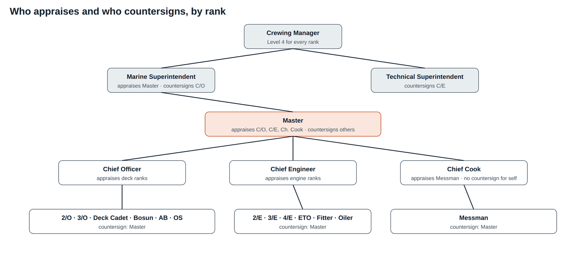

# 01 Business Process Document

*The company procedure for the yearly appraisal of every seafarer: roles, approval levels, timetable, goal setting, rating guidance, decisions, records and regulatory context.*

| | |
| --- | --- |
| Document ID | FAD-01 |
| Version | 2.1 · 3 October 2026 |
| Author | Yasin Jariwala |
| Audience | Crewing, marine and technical superintendents, Masters and heads of department; domain reviewers |

**Purpose.** Defines the business process the software implements, written as a ship-manager procedure (SOP) so that it can be adopted into a Safety Management System manual with minimal editing.

← [00 Project Overview](00_Project_Overview.md) · [Index](README.md) · [02 Product Requirements Document](02_Product_Requirements_Document.md) →

<strong>Contents</strong>

- [1. Purpose and scope](#1-purpose-and-scope)
   - [1.1 Out of scope](#11-out-of-scope)
   - [1.2 Two appraisal levels](#12-two-appraisal-levels)
- [2. Regulatory and industry context](#2-regulatory-and-industry-context)
- [3. Definitions](#3-definitions)
- [4. Roles and responsibilities](#4-roles-and-responsibilities)
   - [4.1 RACI by step](#41-raci-by-step)
- [5. Approval levels by rank](#5-approval-levels-by-rank)
- [6. Annual timetable](#6-annual-timetable)
- [7. Procedure](#7-procedure)
   - [7.1 Before step 1: open the year](#71-before-step-1-open-the-year)
   - [7.2 Step 1: Set goals (seafarer)](#72-step-1-set-goals-seafarer)
   - [7.3 Step 2: Agree goals (appraiser)](#73-step-2-agree-goals-appraiser)
   - [7.4 Step 3: Self-evaluation (Level 1)](#74-step-3-self-evaluation-level-1)
   - [7.5 Step 4: Appraiser evaluation (Level 2)](#75-step-4-appraiser-evaluation-level-2)
   - [7.6 Step 5: Acknowledge](#76-step-5-acknowledge)
   - [7.7 Step 6: Countersign (Level 3)](#77-step-6-countersign-level-3)
   - [7.8 Step 7: Office approval (Level 4)](#78-step-7-office-approval-level-4)
- [8. Setting good goals](#8-setting-good-goals)
   - [8.1 Officer template](#81-officer-template)
   - [8.2 Non-Officer template](#82-non-officer-template)
   - [8.3 Goal library](#83-goal-library)
- [9. How to rate](#9-how-to-rate)
   - [9.1 Calculating the overall rating](#91-calculating-the-overall-rating)
   - [9.2 Fair rating practice](#92-fair-rating-practice)
- [10. Recommendations and decisions](#10-recommendations-and-decisions)
- [11. Comparing with peers](#11-comparing-with-peers)
- [12. Exceptions](#12-exceptions)
- [13. Records, retention and measures](#13-records-retention-and-measures)
   - [13.1 From paper form to system](#131-from-paper-form-to-system)

---

## 1. Purpose and scope

This procedure sets out how every seafarer employed or managed by the company is appraised **once per calendar year (1 January to 31 December)** against goals agreed at the start of the year. It applies to all ranks on all managed vessels, whatever the flag or trade, and to every crew member whether employed directly or supplied through a manning agency.

The appraisal has five aims:

1. Agree clear, measurable goals with every seafarer, so they know what good performance looks like on their vessel.
2. Give the seafarer a voice: a self-evaluation is recorded **before** the appraiser rates them.
3. Rate performance on evidence, on a 5-point scale applied the same way across the fleet.
4. Give the office a sound basis for re-hire, promotion and training decisions.
5. Show how each person compares with the same rank in our fleet and in the wider industry, so that ratings can be calibrated and talent spotted early.

### 1.1 Out of scope

- **Shore staff appraisals** (office employees follow the corporate HR procedure).
- **Statutory competence assessment.** Certificates of competency, endorsements and STCW training are managed in the crew certificate and training records; this appraisal does not re-assess them.
- **Disciplinary procedure.** Misconduct is handled under the disciplinary procedure and the collective agreement; an appraisal records performance against goals, not disciplinary findings.
- **Pay.** Ratings do not change wages automatically. Promotion approved by the office leads to a new contract at the new rank's wage scale through the normal crew process.

### 1.2 Two appraisal levels

**Table 1: Appraisal levels**

| Level | Ranks | Goal template |
| --- | --- | --- |
| Officer | Master, Chief Officer (C/O), Second Officer (2/O), Third Officer (3/O), Chief Engineer (C/E), Second Engineer (2/E), Third Engineer (3/E), Fourth Engineer (4/E), Electro-Technical Officer (ETO) | Officer template: 5 goals covering safety leadership, inspections, planned work, team development, own development |
| Non-Officer | Deck Cadet, Bosun, Able Seaman (AB), Ordinary Seaman (OS), Fitter, Oiler, Chief Cook, Messman | Non-Officer template: 4 goals covering safe working, assigned work, discipline, learning |

Cadets are placed at Non-Officer level because they work under supervision and their development is recorded in the training record book; a cadet-specific template is an open question (see document 10).

## 2. Regulatory and industry context

No convention prescribes a seafarer appraisal format, but several instruments create the obligations the appraisal helps to meet. The procedure is designed so that its records can be shown as evidence during audits and vetting.

**Table 2: Regulatory context**

| Instrument | What it requires | How this procedure helps |
| --- | --- | --- |
| ISM Code, section 6 (Resources and personnel) | 6.2: ships manned with qualified, certificated and medically fit seafarers. 6.5: procedures to identify training needed in support of the SMS and ensure it is provided. | Every appraisal records training needs; any goal rated 1 or 2 requires training to be chosen; the office assigns it on approval. |
| MLC 2006, Standard A2.1, paragraph 1(e) | Seafarers receive a record of employment on board, which must not contain any statement as to the quality of their work or their wages. | Appraisal results are kept as an internal HR record and are never printed on the discharge book or record of employment. |
| MLC 2006, Regulation 2.3 (hours of work and rest) | Records of rest hours are kept and inspected. | A Conduct goal (accurate work and rest hour records) is in the Non-Officer template and the goal library. |
| STCW Convention and Code | Competence standards for certificates; on-board training for cadets. | Development goals reference CBTs and training record book tasks; competence itself is not re-scored. |
| OCIMF TMSA 3, Element 3 (Recruitment and management of shipboard personnel) | Tanker operators show procedures for selection, promotion and appraisal of all vessel personnel, and track retention. | One documented appraisal per seafarer per year, full history, completion and disagreement KPIs, re-hire status on the crew record. |
| Data protection (e.g. GDPR, India DPDP Act 2023) | Personal data processed for a stated purpose, with access limited and retention defined. | Role-based access, seafarers never see colleagues' names, 5-year retention, benchmark data anonymised. |

> [!NOTE]
> **Sources**
>
> ISM Code section 6 text: [admiraltylawguide.com](https://www.admiraltylawguide.com/conven/ismcode1993.html). MLC 2006 Standard A2.1 1(e): [ILO MLC FAQ C2.1.h](https://faqmlc.ilo.org/en/knowledgebase-category/c21/c21h). TMSA 3 Element 3 summary: [Shipnet, "How to achieve TMSA 3 compliance"](https://blog.shipnet.no/blog/articles/how-to-achieve-tmsa-3-compliance-3).

## 3. Definitions

**Table 3: Definitions**

| Term | Meaning in this procedure |
| --- | --- |
| Appraisal | The single yearly record for one seafarer: goals, ratings, comments, recommendations, decision and history. Identified as A{year}-{Crew ID}, for example A2026-V1-2O. |
| Appraisee / seafarer | The person being appraised. |
| Appraiser (HOD) | The head of department who supervises the seafarer on board and gives the Level 2 rating. |
| Countersigner | The Master or a superintendent who checks the appraisal is fair and evidenced (Level 3). |
| Office approver | The Crewing Manager, who makes the re-hire, promotion and training decision (Level 4). |
| Goal | A result the seafarer commits to for the year, with an area, a measurable target and a weight. |
| Weight | The share of the overall rating that a goal carries, in whole percent; all weights total 100%. |
| Overall rating | The weighted average of goal ratings, to two decimals, on the 1–5 scale. |
| Band | The word label for an overall rating: Outstanding, Exceeds, Meets, Needs improvement, Unsatisfactory. |
| Send-back | Returning the appraisal to an earlier step with a written remark. |
| Benchmark data | Anonymised overall ratings from other ship managers, by rank and year, used for the industry comparison. |
| Joiner | A seafarer who signs on for the first time during the year. |

## 4. Roles and responsibilities

**Table 4: Responsibilities**

| Role | Responsibilities |
| --- | --- |
| Seafarer | Drafts goals within the first month (or 14 days after joining); completes the self-evaluation honestly with examples; acknowledges the final ratings, recording disagreement if any. |
| Head of department (appraiser) | Helps the seafarer set realistic goals and agrees them; gives feedback during the year; rates each goal on evidence after reading the self-evaluation; discusses the result face to face before submitting; recommends re-hire, promotion and training. |
| Master | Appraises the C/O, C/E and Chief Cook; countersigns all other ranks on board; ensures appraisals are completed before sign-off; returns appraisals that are not fair or evidenced. |
| Marine Superintendent | Appraises the Master; countersigns the C/O; reviews fleet results for deck ranks. |
| Technical Superintendent | Countersigns the C/E; reviews fleet results for engine ranks. |
| Crewing Manager | Opens the year; approves and closes every appraisal; decides re-hire, promotion and training; maintains benchmark data; monitors KPIs; reports to management review. |
| HR administrator | Maintains goal templates, the goal library, training course list, thresholds and the approval chain. |

### 4.1 RACI by step

R = does the step, A = approves, C = consulted, I = informed.

**Table 5: RACI matrix**

| Step | Seafarer | Appraiser | Master | Superintendent | Crewing Mgr |
| --- | --- | --- | --- | --- | --- |
| 1 Set goals | R | C | I |  | I |
| 2 Agree goals | C | A |  |  | I |
| 3 Self-evaluation (L1) | R | I |  |  |  |
| 4 Appraiser evaluation (L2) | I | R | C |  |  |
| 5 Acknowledge | R | I | I |  |  |
| 6 Countersign (L3) |  | I | A (most ranks) | A (Master, C/O, C/E chain) | I |
| 7 Office approval (L4) | I | I | I | C | A |
| Comparison and planning | I (own) | C (team) | C (vessel) | C (fleet) | R |

## 5. Approval levels by rank

Level 1 is always the seafarer's own self-evaluation. Levels 2 and 3 follow the line of command on board; Level 4 is always the office.

**Table 6: Approval chain**

| Rank | Level 2: appraiser | Level 3: countersign | Level 4: office |
| --- | --- | --- | --- |
| Master | Marine Superintendent | none | Crewing Manager |
| Chief Officer | Master | Marine Superintendent | Crewing Manager |
| Chief Engineer | Master | Technical Superintendent | Crewing Manager |
| 2/O, 3/O, Deck Cadet, Bosun, AB, OS | Chief Officer | Master | Crewing Manager |
| 2/E, 3/E, 4/E, ETO, Fitter, Oiler | Chief Engineer | Master | Crewing Manager |
| Chief Cook | Master | none | Crewing Manager |
| Messman | Chief Cook | Master | Crewing Manager |

<em>Figure 1: Approval chain as a hierarchy</em>

On-board roles always resolve to whoever holds that rank on the vessel at the time of the step, so a relieving Chief Officer takes over the appraisals still open. Office roles are named users.

## 6. Annual timetable

The company rotation is about 4 months on board and 4 months at home. A seafarer may therefore be on board for one or two contracts in a year and may be at home when the year ends. The timetable is built around that rotation: evaluations happen **while the appraiser who saw the work is still on board with the seafarer**.

**Table 7: Annual timetable**

| When | What happens | Who |
| --- | --- | --- |
| 1 January | Appraisal opened for every seafarer in service, with the level template as draft goals | System (Crewing Manager runs "open year") |
| By 31 January | Goals set and agreed. Joiners: within 14 days of first sign-on in the year | Seafarer, appraiser |
| During the year | Seafarer works to the goals; appraiser gives informal feedback on board; evidence builds in PMS, QHSE and training records | All |
| Last 14 days on board, or by 30 November | Self-evaluation, then appraiser evaluation. Whichever comes first: sign-off from the last contract of the year, or 30 November for crew still on board | Seafarer, appraiser |
| Within 7 days of the evaluation | Seafarer acknowledges; countersign follows within 7 days | Seafarer, countersigner |
| By 31 January of the next year | Office approval: re-hire, promotion and training decided and recorded | Crewing Manager |

Reminders are sent each week while a step is open and the step escalates to the next level 14 days after its due date (see 03 Workflow Specification, section 6).

## 7. Procedure

### 7.1 Before step 1: open the year

On 1 January the Crewing Manager opens the year. Every seafarer in service receives one appraisal for the year with the goal template for their level as draft goals. Joiners receive theirs at first sign-on. A seafarer cannot have two appraisals for the same year (BR-02).

### 7.2 Step 1: Set goals (seafarer)

The seafarer reviews the draft, adapts it to their vessel and role, adds goals from the library or writes their own, sets the weights and sends the goals to the appraiser. The goal rules are:

- 3 to 6 goals.
- Each goal has a title and a measurable target.
- Each weight is a whole number of at least 10%, and the weights total 100%.
- Exactly one Safety goal, weighted at least 20%.

### 7.3 Step 2: Agree goals (appraiser)

The appraiser checks that the goals fit the vessel, the trade and the person, adjusts them if needed and agrees them, or sends them back with a remark. The appraiser may also agree goals directly while they are being set, for example at the pre-joining briefing when the seafarer asks for help. Agreed goals are locked for the year.

### 7.4 Step 3: Self-evaluation (Level 1)

The seafarer rates each goal from 1 to 5, explains any 1, 2 or 5 in a comment, and writes their key achievements (required), the challenges they faced and the support they would like. The appraiser cannot see the self-evaluation until it is submitted.

### 7.5 Step 4: Appraiser evaluation (Level 2)

The appraiser reads the self-evaluation, then rates each goal from 1 to 5 and writes evidence for any 1, 2 or 5. They record strengths, areas to improve, a re-hire recommendation, promotion readiness and training. **The appraiser discusses the result with the seafarer face to face before submitting.** If the self-evaluation is incomplete or careless they send it back with a remark.

### 7.6 Step 5: Acknowledge

The seafarer reads the appraiser's ratings and agrees or disagrees. A disagreement needs a comment and stays on the record; it is shown to the countersigner and the office.

### 7.7 Step 6: Countersign (Level 3)

The countersigner checks that the ratings are fair, consistent with others on board and supported by evidence. They countersign with optional remarks, or send the appraisal back to the appraiser with a remark. A send-back clears the acknowledgement, so the seafarer sees and acknowledges the corrected ratings again. Ranks with no countersigner (Master, Chief Cook) go straight to office approval.

### 7.8 Step 7: Office approval (Level 4)

The Crewing Manager reviews the appraisal, the seafarer's comment and the comparison with peers, then decides:

- **Re-hire**: Approved, Approved with reservations, or Not for re-hire (remarks required).
- **Promotion**: approved or not (only where a next rank exists).
- **Training**: courses assigned before the next contract.

The appraisal is then closed (step 8) and the decision written to the crew record. The Crewing Manager may instead send it back to the appraiser with a remark.

## 8. Setting good goals

Goals describe what the seafarer will deliver this year, with a target the appraiser can check against records. Templates are a starting point; seafarer and appraiser should make them fit the vessel and the person. A good goal is specific to the role, measurable from existing records (PMS, QHSE, logbooks, training records), achievable within the contracts served, and weighted by importance.

### 8.1 Officer template

**Table 8: Officer goal template**

| Goal | Area | Target | Weight |
| --- | --- | --- | --- |
| Lead safe operations in my department | Safety | Zero lost-time injuries; 100% drills and toolbox talks; permits to work closed correctly | 25% |
| Clean inspections | Compliance | No PSC, vetting or audit findings in my area of responsibility | 20% |
| Planned work on time | Operations | 100% of PMS jobs (engine) or voyage and cargo plans (deck) done on time | 20% |
| Lead and develop the team | Teamwork | Familiarisation and on-board training complete for every junior I supervise | 15% |
| My own development | Development | All assigned CBTs complete; one competence course before next contract | 20% |

### 8.2 Non-Officer template

**Table 9: Non-Officer goal template**

| Goal | Area | Target | Weight |
| --- | --- | --- | --- |
| Work safely | Safety | Zero injuries; PPE and permit to work always followed; 100% drill attendance | 30% |
| Assigned work done well | Operations | PMS jobs and daily work orders done on time and to standard | 30% |
| Reliable and disciplined | Conduct | No warnings; work and rest hours recorded accurately | 20% |
| Keep learning | Development | Assigned CBTs and training record book tasks complete | 20% |

### 8.3 Goal library

**Table 10: Goal library (13 goals)**

| Goal | Area | For | Target |
| --- | --- | --- | --- |
| Mooring operations without incident | Safety | Deck | Zero mooring incidents; snap-back zones briefed before every operation |
| Enclosed space entry done right | Safety | All | 100% entries with permit, gas test and rescue team ready |
| Cargo operations without claims | Operations | Deck | No cargo damage or shortage claims; stability checked every stage |
| Bunkering without spills | Operations | Engine | Zero spills; checklist and soundings complete for every bunkering |
| Fuel efficiency | Operations | Engine | Main engine fuel consumption within 2% of the performance curve |
| Navigation records in order | Compliance | Deck | ECDIS, passage plans and log books 100% compliant at every audit |
| Environmental records in order | Compliance | All | Oil Record Book and Garbage Record Book with no findings |
| Mentor a cadet | Teamwork | Officer | Cadet's training record book tasks for this period signed off |
| Speak up for safety | Teamwork | All | At least one near-miss or improvement report each month |
| Galley hygiene | Compliance | Catering | No findings in Master's weekly galley and provisions inspection |
| Food within budget | Operations | Catering | Victualling within the daily allowance; crew satisfaction 4 of 5 or better |
| Prepare for promotion | Development | All | Complete the next-rank familiarisation and a competency check with the HOD |
| Rest-hour compliance | Conduct | All | No MLC rest-hour non-conformities |

Because exactly one Safety goal is allowed, a Safety goal taken from the library (mooring, enclosed space entry) **replaces** the template's Safety goal rather than being added to it.

## 9. How to rate

**Table 11: Rating scale**

| Rating | Meaning | Typical evidence | Comment |
| --- | --- | --- | --- |
| 5 Outstanding | Clearly beyond the target, and lifted others | Specific events, commendations, zero findings plus improvements led | Required |
| 4 Exceeds expectations | Target met with something extra | Target met early or with less supervision | Optional |
| 3 Meets expectations | Target met | Records show the target was achieved | Optional |
| 2 Needs improvement | Target partly missed | Overdue items, reminders needed | Required; training required |
| 1 Unsatisfactory | Target clearly missed | Findings, incidents or warnings | Required; training required |

### 9.1 Calculating the overall rating

The overall rating is the weighted average of the goal ratings, rounded to two decimals. Worked example for an officer:

**Table 12: Weighted overall example**

| Goal | Weight | Rating | Weight × rating |
| --- | --- | --- | --- |
| Lead safe operations | 25% | 4 | 1.00 |
| Clean inspections | 20% | 2 | 0.40 |
| Planned work on time | 20% | 4 | 0.80 |
| Lead and develop the team | 15% | 4 | 0.60 |
| My own development | 20% | 4 | 0.80 |
| **Overall** | 100% |  | **3.60 (Exceeds expectations)** |

**Table 13: Bands**

| Overall rating | Band |
| --- | --- |
| 4.50 – 5.00 | Outstanding |
| 3.50 – 4.49 | Exceeds expectations |
| 2.50 – 3.49 | Meets expectations |
| 1.50 – 2.49 | Needs improvement |
| 1.00 – 1.49 | Unsatisfactory |

### 9.2 Fair rating practice

- Rate the year, not the last week. Look at PMS, QHSE, logbook and training records for the whole period.
- Rate each goal against its own target, not against the person's general reputation.
- Avoid the safe middle. A 4 for everyone hides both talent and risk; the comparison pages show when a vessel or a rank is rated more generously than the fleet.
- Discuss before submitting. The seafarer should never learn their rating for the first time from the system.

## 10. Recommendations and decisions

**Table 14: Decision rules**

| Decision | Allowed only when | Rule |
| --- | --- | --- |
| Re-hire "Recommended" (appraiser) | Overall ≥ 2.50 and Safety goal rated ≥ 3 | BR-08 |
| Promotion "Ready now" (appraiser) | Overall ≥ 3.50, Safety goal rated 4 or 5, and the rank has a next rank | BR-08 |
| Training | Must be chosen when any goal is rated 1 or 2 | BR-08 |
| Office "Approved" | Overall ≥ 2.50 | BR-12 |
| Office "Not for re-hire" | Written remarks required | BR-12 |
| Office promotion approval | Only for ranks with a next rank | BR-12 |

Ranks without a next rank in the promotion path (Master, Chief Engineer, ETO, Bosun, Fitter, Chief Cook) record promotion readiness as "Not applicable".

## 11. Comparing with peers

Once the appraiser has submitted, the seafarer's overall rating can be compared with:

- **Our fleet**: their position among everyone of the same rank this year, and the share of the others they scored higher than.
- **The industry**: their percentile among the same rank across the benchmark companies plus our fleet, from the benchmark data loaded by the Crewing Manager.
- **Goal areas**: their rating in each area against the fleet and industry averages.

The comparison informs the office decision; it never replaces the evidence in the appraisal. When fewer than four others of the same rank have been rated, the page says so and the figures should be read with care. Seafarers see only their own comparison and never colleagues' names.

## 12. Exceptions

**Table 15: Exceptions**

| Situation | What to do |
| --- | --- |
| Seafarer joins mid-year | Appraisal opens at first sign-on; goals within 14 days. |
| Seafarer signs off before 30 November and will not return this year | Self-evaluation and appraiser evaluation in the last 14 days on board. |
| Seafarer is on leave on 30 November | Evaluation is done at the end of their last contract of the year; if none, the Crewing Manager decides with the last appraiser by email and records it. |
| Appraiser signs off | The relieving head of department takes over open appraisals; the outgoing appraiser leaves a handover note. |
| Seafarer changes rank during the year | This year stays in the rank it was opened in; next year opens in the new rank. |
| Seafarer changes vessel during the year | Appraisal follows the seafarer; the appraiser is the HOD on the vessel where the evaluation is done, who consults the previous HOD. |
| Seafarer disagrees | Comment recorded; countersigner and office see it before deciding; the office may discuss with the seafarer. |
| Appraisal looks unfair or unsupported | Countersigner or office sends it back to the appraiser with a remark. |
| Medical sign-off or emergency repatriation | Steps are paused; the Crewing Manager completes from available records on return. |

## 13. Records, retention and measures

For each appraisal the system keeps the goals, every rating and comment, the acknowledgement, countersign and office decision, and the full history of who did what and when. Records are kept for **at least 5 years** after closure and form part of the crew file for TMSA audits. History entries cannot be edited.

**Table 16: Process KPIs**

| Measure | Target | Why it matters |
| --- | --- | --- |
| Goals agreed by 31 January (joiners: within 14 days) | 95% | Seafarers start the year knowing what is expected |
| Self-evaluations submitted before the appraiser rates | 100% | The seafarer's voice is on record |
| Appraisals closed by 31 January of the next year | 90% | Decisions are ready before crew planning for the next contracts |
| Appraisals the seafarer disagreed with | below 10% | Indicates surprises and weak face-to-face discussion |
| Spread of median rating between vessels, same rank | below 0.50 | Indicates consistent rating across the fleet |
| Gap between self and appraiser rating, fleet average | tracked | Shows calibration; not targeted, to avoid gaming |

### 13.1 From paper form to system

**Table 17: Mapping the paper form**

| Typical paper form section | Where it lives in the system |
| --- | --- |
| Particulars (name, rank, vessel, period) | Appraisal header, filled from the crew record |
| Objectives for the period | Goals with area, target and weight |
| Self-assessment | Self-evaluation: ratings, comments, achievements, challenges, support |
| Appraiser's assessment and comments | Appraiser evaluation: ratings, evidence, strengths, areas to improve |
| Recommendation for re-employment / promotion | Re-hire recommendation and promotion readiness |
| Training needs | Training checklist (appraiser) and assigned training (office) |
| Seafarer's signature and comments | Acknowledgement: agree or disagree with comment |
| Master's / superintendent's countersignature | Countersign step with remarks |
| Office use only | Office approval: decision, promotion, training, remarks |

---

← [00 Project Overview](00_Project_Overview.md) · [Index](README.md) · [02 Product Requirements Document](02_Product_Requirements_Document.md) →
