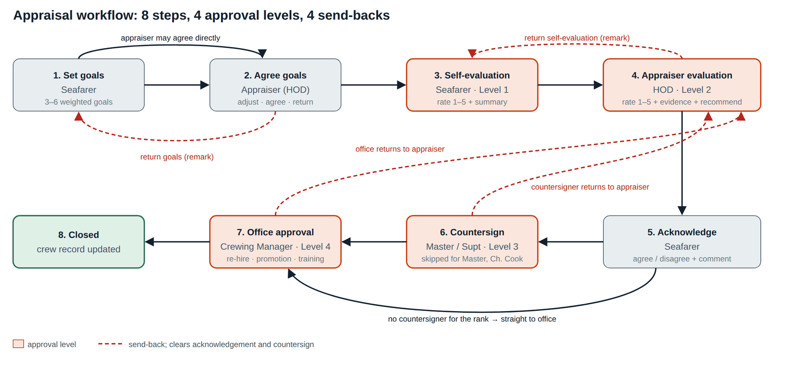

# 03 Workflow Specification

*The appraisal as a state machine: steps, transitions, guards, who may act, what each person can see, due dates, reminders, escalations, notifications and exceptions.*

| | |
| --- | --- |
| Document ID | FAD-03 |
| Version | 2.1 · 3 October 2026 |
| Author | Yasin Jariwala |
| Audience | Product, engineering and QA reviewers; process owners |

**Purpose.** Specifies the workflow precisely enough to implement and test it: every transition, its actor, its guard conditions and its side effects.

← [02 Product Requirements Document](02_Product_Requirements_Document.md) · [Index](README.md) · [04 Functional Specification](04_Functional_Specification.md) →

<strong>Contents</strong>

- [1. Workflow at a glance](#1-workflow-at-a-glance)
- [2. Transitions](#2-transitions)
- [3. Who acts for each rank](#3-who-acts-for-each-rank)
- [4. Swimlane: one appraisal end to end](#4-swimlane-one-appraisal-end-to-end)
- [5. What each person can see](#5-what-each-person-can-see)
- [6. Timetable, reminders and escalation](#6-timetable-reminders-and-escalation)
- [7. Notifications](#7-notifications)
- [8. Send-back rules](#8-send-back-rules)
- [9. Exceptions](#9-exceptions)

---

## 1. Workflow at a glance

Each seafarer has one appraisal per calendar year. It moves through **eight steps**; four of them are the **approval levels** (shaded below). Each step has exactly one person who can act, and the worklist shows it to them. Four transitions send the appraisal back, and every send-back needs a written remark.

<em>Figure 1: Appraisal workflow (state diagram)</em>

**Table 1: Steps**

| # | Step (state code) | Approval level | Who acts | Typical duration |
| --- | --- | --- | --- | --- |
| 1 | Set goals (`Goals`) |  | Seafarer; the appraiser may also edit | 1–2 weeks |
| 2 | Agree goals (`GoalsReview`) |  | Appraiser | under 1 week |
| 3 | Self-evaluation (`Self`) | Level 1 | Seafarer | most of the year; done in last 14 days on board |
| 4 | Appraiser rates (`Appraiser`) | Level 2 | Appraiser (HOD) | under 7 days |
| 5 | Acknowledge (`Ack`) |  | Seafarer | under 7 days |
| 6 | Countersign (`Reviewer`) | Level 3 | Master or superintendent | under 7 days |
| 7 | Office approval (`Office`) | Level 4 | Crewing Manager | by 31 January next year |
| 8 | Closed (`Done`) |  | none (read only) |  |

## 2. Transitions

Every transition is a command on the API. The server checks, in this order: the caller is signed in (401), the appraisal exists and is in the caller's scope (404/403), the appraisal is at the expected step (409), the caller is the person whose step it is (403), and the business rules pass (422). Only then is the change saved and a history entry written.

**Table 2: Transition table**

| ID | From → To | Command (API) | Actor | Guard (rules) | Side effects |
| --- | --- | --- | --- | --- | --- |
| T-01 | (none) → Goals | POST /appraisals/open-year, POST /appraisals/joiner/{id} | Crewing Manager | No appraisal for that seafarer and year (BR-02) | Template goals loaded; N-01 |
| T-02 | Goals → Goals | PUT /appraisals/{id}/goals | Seafarer or appraiser | Step is Goals or GoalsReview | Draft saved |
| T-03 | Goals → GoalsReview | POST …/goals/submit | Seafarer | Goal rules (BR-03) | N-02 |
| T-04 | Goals or GoalsReview → Self | POST …/goals/agree | Appraiser | Goal rules (BR-03, BR-04) | Goals locked; N-04 |
| T-05 | GoalsReview → Goals | POST …/goals/return | Appraiser | Remark not blank (BR-14) | N-03 |
| T-06 | Self → Self | PUT …/self | Seafarer | Ratings 1–5 | Draft saved; hidden from appraiser |
| T-07 | Self → Appraiser | POST …/self/submit | Seafarer | Every goal rated; comment for 1, 2, 5; achievements (BR-05) | Self ratings become visible (BR-06); N-05 |
| T-08 | Appraiser → Appraiser | PUT …/evaluation | Appraiser | Ratings 1–5 | Draft saved; hidden from seafarer |
| T-09 | Appraiser → Self | POST …/evaluation/return | Appraiser | Remark not blank | N-06 |
| T-10 | Appraiser → Ack | POST …/evaluation/submit | Appraiser | BR-07, BR-08 | Appraiser ratings visible; enters comparison (BR-16); N-07 |
| T-11 | Ack → Reviewer | POST …/acknowledge | Seafarer | Comment if disagree (BR-09); rank has a countersigner | N-08 to countersigner |
| T-12 | Ack → Office | POST …/acknowledge | Seafarer | BR-09; rank has no countersigner (BR-11) | N-08 to Crewing Manager |
| T-13 | Reviewer → Office | POST …/countersign | Countersigner | Caller is the countersigner for the rank (BR-10) | N-09 |
| T-14 | Reviewer or Office → Appraiser | POST …/return-to-appraiser | Countersigner or Crewing Manager | Remark not blank (BR-14) | Acknowledgement and countersign cleared; N-10 |
| T-15 | Office → Done | POST …/approve | Crewing Manager | BR-12 | Crew record updated (re-hire, promotion, training); N-11 |

> [!NOTE]
> **Why the stage check matters**
>
> Two people may have the same appraisal open (for example the Master and the Crewing Manager). If one acts first, the other's command is refused with 409 "the appraisal is at a different step" and the screen reloads, so nobody overwrites a decision they did not see.

## 3. Who acts for each rank

Onboard roles resolve to whoever holds that rank on the vessel today; office roles are named users. The chain is reference data (`Rank.AppraiserRole`, `Rank.ReviewerRole`) and can be changed without a release.

**Table 3: Rank reference: chain and promotion path**

| Rank | Code | Level | Appraiser | Countersign | Next rank |
| --- | --- | --- | --- | --- | --- |
| Master | MST | Officer | Marine Superintendent | none | — |
| Chief Officer | CO | Officer | Master | Marine Superintendent | Master |
| Second Officer | 2O | Officer | Chief Officer | Master | Chief Officer |
| Third Officer | 3O | Officer | Chief Officer | Master | Second Officer |
| Chief Engineer | CE | Officer | Master | Technical Superintendent | — |
| Second Engineer | 2E | Officer | Chief Engineer | Master | Chief Engineer |
| Third Engineer | 3E | Officer | Chief Engineer | Master | Second Engineer |
| Fourth Engineer | 4E | Officer | Chief Engineer | Master | Third Engineer |
| Electro-Technical Officer | ETO | Officer | Chief Engineer | Master | — |
| Deck Cadet | DCD | Non-Officer | Chief Officer | Master | Third Officer |
| Bosun | BSN | Non-Officer | Chief Officer | Master | — |
| Able Seaman | AB | Non-Officer | Chief Officer | Master | Bosun |
| Ordinary Seaman | OS | Non-Officer | Chief Officer | Master | Able Seaman |
| Fitter | FTR | Non-Officer | Chief Engineer | Master | — |
| Oiler | OLR | Non-Officer | Chief Engineer | Master | Fitter |
| Chief Cook | CCK | Non-Officer | Master | none | — |
| Messman | MSM | Non-Officer | Chief Cook | Master | Chief Cook |

Office approval for every rank is by the Crewing Manager. The "next rank" column drives which promotion choices are allowed (BR-08, BR-12).

## 4. Swimlane: one appraisal end to end

**Table 4: Swimlane**

| Step | Seafarer | Appraiser (HOD) | Master / Supt | Crewing Manager |
| --- | --- | --- | --- | --- |
| 1 | Drafts 3–6 goals; sends |  |  | Opened the year |
| 2 |  | Adjusts; agrees or returns |  |  |
| 3 | Rates each goal; writes summary; submits | Cannot see drafts |  |  |
| 4 | Cannot see drafts | Reads self ratings; rates with evidence; recommends; discusses face to face; submits |  |  |
| 5 | Reads ratings; agrees or disagrees with comment |  |  |  |
| 6 |  | (Receives returns) | Checks fairness; countersigns or returns |  |
| 7 |  | (Receives returns) | Consulted | Reviews comparison; decides re-hire, promotion, training; closes or returns |
| 8 | Sees decision | Sees decision |  | Crew record updated |

## 5. What each person can see

Visibility is enforced by the server: responses leave out data the caller may not see yet (BR-06), rather than relying on the screen to hide it.

**Table 5: Visibility matrix**

| Person | Self ratings | Appraiser ratings | Comparison |
| --- | --- | --- | --- |
| Seafarer | Always (their own) | Once the appraiser submits | Their own only; colleagues shown as "Colleague", names never sent |
| Appraiser | Once the seafarer submits | Always (their own draft) | Everyone they appraise or countersign |
| Master | Once submitted | Once the appraiser submits | Everyone on their vessel |
| Superintendents | Once submitted | Once the appraiser submits | Whole fleet, plus fleet against industry |
| Crewing Manager | Once submitted | Once the appraiser submits | Whole fleet, plus fleet against industry |

**Table 6: Scope of access**

| Person | Appraisals they can open |
| --- | --- |
| Seafarer | Their own |
| Head of department | Their own, and those they appraise or countersign |
| Master | Everyone on their vessel |
| Superintendents, Crewing Manager | Whole fleet |

## 6. Timetable, reminders and escalation

**Table 7: Due dates and escalation**

| Step | Due | Reminder | Escalation (14 days after due) |
| --- | --- | --- | --- |
| Set and agree goals | 31 January; joiners 14 days after first sign-on | Weekly from 15 January | Crewing Manager |
| Self-evaluation | 30 November, or 14 days before the last sign-off of the year | Weekly from 2 weeks before due | Appraiser |
| Appraiser rates | 7 days after the self-evaluation, and before the seafarer signs off | Weekly | Master or superintendent |
| Acknowledge | 7 days after the appraiser submits | After 3 days | Appraiser |
| Countersign | 7 days after acknowledgement | After 3 days | Superintendent |
| Office approval | 31 January of the next year | Weekly from 1 January | Management (configurable contact) |

> [!WARNING]
> **Implementation status**
>
> Due dates, reminders and escalations are specified here and scheduled for v2.2 with production notifications. In v2.1 the worklists show what is waiting for each person and the fleet list shows which step every appraisal is at, with filters.

## 7. Notifications

**Table 8: Notification catalogue**

| ID | Event | To | Message (template) |
| --- | --- | --- | --- |
| N-01 | Appraisal opened | Seafarer | Your {year} appraisal is open. Set your goals by {due}. |
| N-02 | Goals sent for agreement | Appraiser | {name} ({rank}) has sent goals for your agreement. |
| N-03 | Goals sent back | Seafarer | {appraiser} returned your goals: "{remark}". |
| N-04 | Goals agreed | Seafarer | Your goals are agreed. Your self-evaluation is due by {due}. |
| N-05 | Self-evaluation submitted | Appraiser | {name} has completed their self-evaluation. Please evaluate by {due}. |
| N-06 | Self-evaluation sent back | Seafarer | {appraiser} returned your self-evaluation: "{remark}". |
| N-07 | Appraiser has rated | Seafarer | {appraiser} has completed your appraisal. Please read and acknowledge. |
| N-08 | Acknowledged | Countersigner, or Crewing Manager if none | {name} has acknowledged ({agreed / disagreed}). |
| N-09 | Countersigned | Crewing Manager | {countersigner} has countersigned {name}'s appraisal. |
| N-10 | Sent back to appraiser | Appraiser | {actor} returned {name}'s appraisal: "{remark}". |
| N-11 | Approved and closed | Seafarer, appraiser | Your appraisal is closed. Re-hire: {decision}. Training: {training}. |
| N-12 | Step due soon / overdue | Whoever holds the step; escalation as above | {step} for {name} is due {due} / overdue by {days} days. |

Notifications go by email and in-app; on board they are queued and delivered at the next ship–shore synchronisation. N-11 deliberately does not include the overall rating, so a decision email forwarded or printed does not carry performance scores.

## 8. Send-back rules

- Every send-back needs a non-blank remark (BR-14); the remark is shown at the top of the appraisal for the person it returns to and kept in the history.
- A send-back to the appraiser (T-14) clears the acknowledgement and the countersign. The seafarer must see and acknowledge the corrected ratings again, so no one countersigns ratings the seafarer has not seen.
- Goals cannot be sent back after they are agreed. If goals turn out wrong mid-year (e.g. vessel change), the appraiser rates the goals as agreed and explains in evidence; a mid-year goal change is an open question for v2.3.
- The seafarer cannot send anything back; their route to disagree is the acknowledgement comment.

## 9. Exceptions

**Table 9: Exception handling**

| Situation | What the system does |
| --- | --- |
| Joiner during the year | Crewing opens the appraisal at first sign-on (`POST /appraisals/joiner/{id}`) with the level template |
| Relieving head of department | Open appraisals move to the new holder of the rank automatically, because the appraiser is resolved from the vessel and rank |
| Seafarer disagrees | The disagreement and comment stay on record and are shown to the countersigner and the office |
| Ratings look unfair or unsupported | Countersigner or office sends the appraisal back to the appraiser with a remark |
| Self-evaluation incomplete or careless | Appraiser sends it back to the seafarer with a remark |
| Promotion approved for a rank with no next rank | Refused (BR-12) |
| Someone acts on a step that is not theirs | Refused with "not waiting for you" (BR-15, HTTP 403) |
| Two people act on the same step | Second command refused with 409; screen reloads to show the new state |
| Fewer than four others of the same rank rated | Comparison shown but flagged "read with care" (BR-16) |
| Session expires mid-edit | Next call returns 401; the app returns to sign-in and then to the same page; unsaved edits trigger a browser warning before leaving |

---

← [02 Product Requirements Document](02_Product_Requirements_Document.md) · [Index](README.md) · [04 Functional Specification](04_Functional_Specification.md) →
