# 04 Functional Specification

*Every screen with annotated screenshots, its fields, actions and validation; the 18 business rules; the data dictionary; the scoring and comparison calculations; configuration and messages.*

| | |
| --- | --- |
| Document ID | FAD-04 |
| Version | 2.1 · 3 October 2026 |
| Author | Yasin Jariwala |
| Audience | Product, engineering, QA and domain reviewers |

**Purpose.** Describes exactly how the module behaves for each user, so that it can be built, tested and accepted against a single reference. Screenshots are from the v2.1 build running on the demo fleet.

← [03 Workflow Specification](03_Workflow_Specification.md) · [Index](README.md) · [05 Technical Design Document](05_Technical_Design_Document.md) →

<details><summary><strong>Contents</strong></summary>

- [1. Screen inventory](#1-screen-inventory)
   - [1.1 Common behaviour](#11-common-behaviour)
- [2. Screens](#2-screens)
   - [2.1 SC-01 Sign in](#21-sc-01-sign-in)
   - [2.2 SC-02 My work](#22-sc-02-my-work)
   - [2.3 SC-03 Appraisal page: header, stepper and scores](#23-sc-03-appraisal-page-header-stepper-and-scores)
   - [2.4 SC-04 Goal editor](#24-sc-04-goal-editor)
   - [2.5 SC-05 Self-evaluation](#25-sc-05-self-evaluation)
   - [2.6 SC-06 Appraiser evaluation](#26-sc-06-appraiser-evaluation)
   - [2.7 SC-07 Acknowledge](#27-sc-07-acknowledge)
   - [2.8 SC-08 Countersign](#28-sc-08-countersign)
   - [2.9 SC-09 Office approval](#29-sc-09-office-approval)
   - [2.10 SC-10 Team, vessel crew and fleet list](#210-sc-10-team-vessel-crew-and-fleet-list)
   - [2.11 SC-11 Compare](#211-sc-11-compare)
   - [2.12 SC-12 Benchmark data](#212-sc-12-benchmark-data)
   - [2.13 SC-13 Account and SC-14 Demo data](#213-sc-13-account-and-sc-14-demo-data)
- [3. Business rules](#3-business-rules)
- [4. Data dictionary](#4-data-dictionary)
   - [4.1 Appraisal (one per seafarer per year)](#41-appraisal-one-per-seafarer-per-year)
   - [4.2 Goal (3–6 per appraisal)](#42-goal-36-per-appraisal)
   - [4.3 Crew record fields written on approval](#43-crew-record-fields-written-on-approval)
- [5. Calculations](#5-calculations)
   - [5.1 Overall rating and band (BR-13)](#51-overall-rating-and-band-br-13)
   - [5.2 Comparison (BR-16)](#52-comparison-br-16)
   - [5.3 Benchmark file layout (BR-17)](#53-benchmark-file-layout-br-17)
- [6. Configuration](#6-configuration)
- [7. System messages](#7-system-messages)

</details>

---

## 1. Screen inventory

**Table 1: Screens**

| ID | Screen | Link | Used by | What it does |
| --- | --- | --- | --- | --- |
| SC-01 | Sign in | `#login` | Everyone | Crew ID or office user and password; demo accounts listed when enabled |
| SC-02 | My work | `#work` | Appraisers, Master, superintendents, Crewing | Items waiting for me with the action to take; my own appraisal; items with others |
| SC-03 | Appraisal (header, stepper, scores, history) | `#app.<id>`; own: `#mine` | Everyone in scope | One appraisal: who acts at each step, live scores, the form for my step, history |
| SC-04 | Goal editor | `#app.<id>` at Goals / GoalsReview | Seafarer, appraiser | Edit title, area, weight, target; add from library; reset to template; live goal checks |
| SC-05 | Self-evaluation | `#app.<id>` at Self | Seafarer | 1–5 per goal, comments, year summary, live score |
| SC-06 | Appraiser evaluation | `#app.<id>` at Appraiser | Appraiser | Self rating beside 1–5 buttons and evidence; strengths, improvements, re-hire, promotion, training; gap |
| SC-07 | Acknowledge | `#app.<id>` at Ack | Seafarer | Ratings shown; agree or disagree with comment |
| SC-08 | Countersign | `#app.<id>` at Reviewer | Master, superintendent | Read-only appraisal; remarks; countersign or send back |
| SC-09 | Office approval | `#app.<id>` at Office | Crewing Manager | Decision, promotion, training, remarks; approve and close or send back |
| SC-10 | Team / vessel crew / fleet list | `#team` | Appraisers, Master, superintendents, Crewing | Filters by vessel, level, step and name; stage counts; average by vessel |
| SC-11 | Compare | `#compare[.<crew>[.<year>]]` | Everyone (scope by role) | Score tiles, distribution by company, goal-area chart, fleet ranking, fleet against industry |
| SC-12 | Benchmark data | `#bench` | Crewing Manager | Data in use and its source; CSV upload with row checks; back to sample |
| SC-13 | Account | `#account` | Every signed-in user (server) | Change password |
| SC-14 | Demo data | `#admin` | Crewing Manager (demo only) | Reset demo data to the starting point |

### 1.1 Common behaviour

- **Header**: product name, the signed-in user's name and title, Account and Sign out. **Tabs** depend on the role (Table 2).
- **Breadcrumbs** on detail pages show the way back (for example "My work › Joseph Santos").
- **"Before you submit" checklist** on every form: each rule turns green as it is met; the submit button stays disabled until all are green. The server applies the same rules and returns any failure as a message beside the form.
- **Live scores**: self, appraiser and gap tiles update as ratings are clicked.
- **Unsaved changes**: leaving a page with unsaved edits asks the browser to confirm.
- **Links**: every screen has its own address; Back, Forward, refresh and bookmarks work. A link opened while signed out goes through sign-in and then to that screen. An unknown link or one the role may not open shows "Page not found" with a link home.
- **Layout**: works from 390 px phone width to desktop; light and dark themes follow the device setting.

**Table 2: Tabs by role**

| Role | Tabs |
| --- | --- |
| Seafarer | My appraisal · How I compare |
| Head of department | My work · My team · My appraisal · Compare |
| Master | My work · Vessel crew · My appraisal · Compare |
| Superintendent | My work · Fleet · Compare |
| Crewing Manager | My work · Fleet · Compare · Benchmark data · Demo data |

## 2. Screens

### 2.1 SC-01 Sign in

Entry point for every user. In production the demo account cards are hidden (`Demo:ShowDemoAccounts=false`) and company SSO can replace the password form.

<p align="center">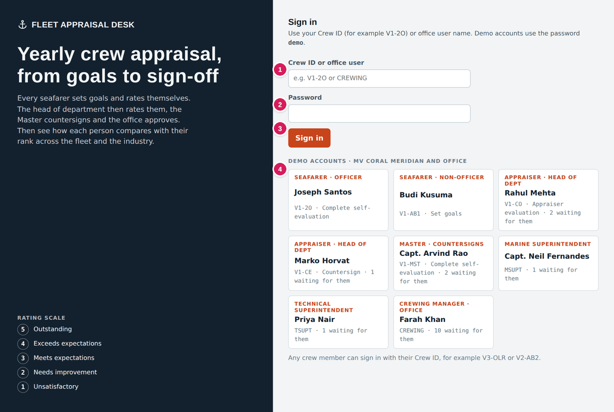</p>

<p align="center"><em>Figure 1: SC-01 Sign in</em></p>

| # | What it is |
| --- | --- |
| 1 | Crew ID or office user name; not case-sensitive (V1-2o = V1-2O). |
| 2 | Password; minimum 8 characters when changed by the user. |
| 3 | Sign in. A wrong ID or password shows "That Crew ID or password is wrong." without saying which. |
| 4 | Demo account cards (demo only): role, name, Crew ID and what is waiting for them. Clicking fills the ID. |

| Field | Type | Validation |
| --- | --- | --- |
| Crew ID or office user | Text | Required; trimmed; upper-cased |
| Password | Password | Required |

After sign-in the user lands on the page they asked for, or on their start page: My appraisal for seafarers, My work for everyone else. If the company requires it (`Demo:MustChangePassword`), the first sign-in goes to Account with "Please choose your own password before you continue."

### 2.2 SC-02 My work

The start page for anyone who acts on other people's appraisals. It answers "what is waiting for me?".

<p align="center">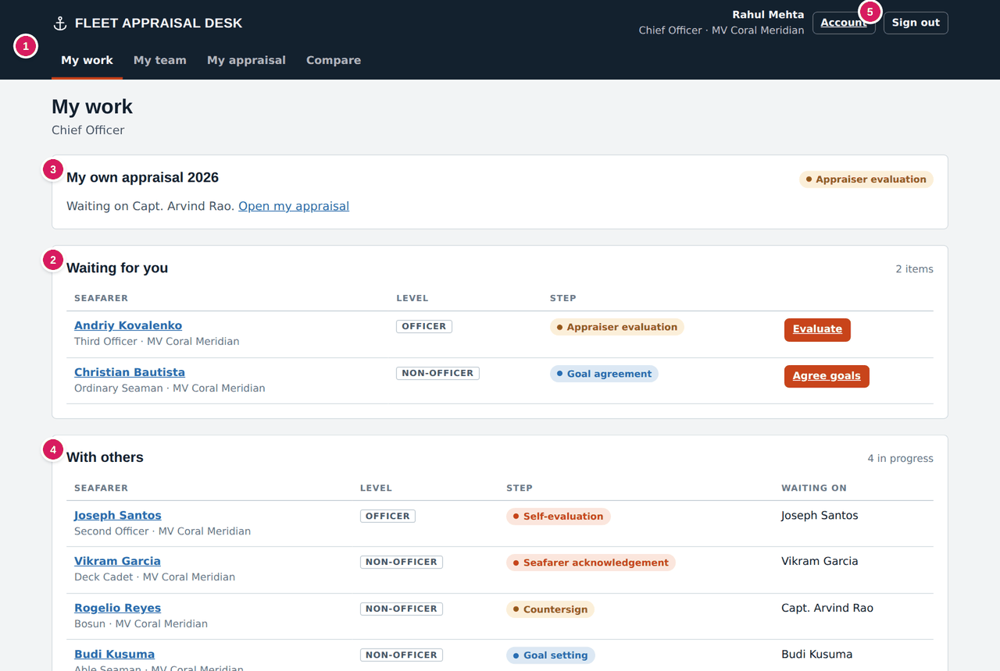</p>

<p align="center"><em>Figure 2: SC-02 My work, signed in as the Chief Officer</em></p>

| # | What it is |
| --- | --- |
| 1 | Role tabs; the current tab is underlined. |
| 2 | Waiting for you: each appraisal where it is my step, with level, step and the action button (Evaluate, Agree goals, Countersign, Approve and close). |
| 3 | My own appraisal, with its step and who it is waiting on. |
| 4 | With others: appraisals in my scope that are waiting on someone else, so I can follow up. |
| 5 | Sign out ends the session on the server. |

<p align="center">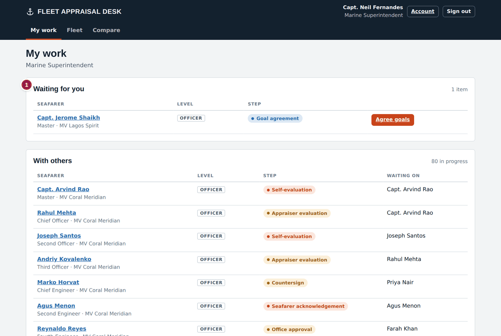</p>

<p align="center"><em>Figure 3: SC-02 My work for the Marine Superintendent: the Master's appraisal to agree goals for, and the fleet appraisals in progress</em></p>

### 2.3 SC-03 Appraisal page: header, stepper and scores

Every appraisal opens on the same page. The top part is common; the form below depends on the step and on who is looking (SC-04 to SC-09).

<p align="center">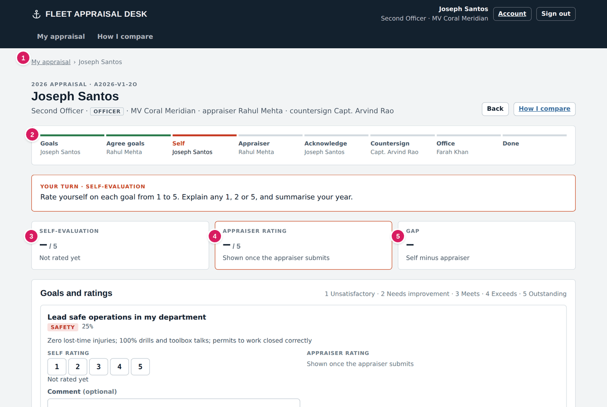</p>

<p align="center"><em>Figure 4: SC-03 Appraisal page for the seafarer at the self-evaluation step</em></p>

| # | What it is |
| --- | --- |
| 1 | Breadcrumbs back to the list the user came from. |
| 2 | Stepper: the 8 steps with the name of the person who acts at each; completed steps green, current step orange. Steps that do not apply to the rank show "Not needed for this rank". |
| 3 | Self-evaluation score (weighted overall and band), shown once available to the viewer. |
| 4 | Appraiser rating, hidden until the appraiser submits (BR-06). |
| 5 | Gap = self minus appraiser; positive means the seafarer rated themselves higher. |

Below the form every appraisal shows its **History**: date, person, action and note for each step, oldest at the bottom (BR-18). A "Your turn" banner explains what to do when the step is the viewer's.

<p align="center">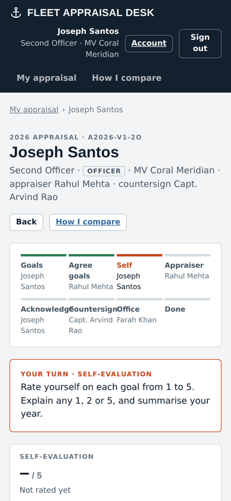</p>

<p align="center"><em>Figure 5: SC-03 on a phone (390 px): the same page stacks vertically; tabs scroll; buttons are full-size touch targets</em></p>

### 2.4 SC-04 Goal editor

Shown to the seafarer at Goal setting and to the appraiser at Goal setting or Goal agreement. Opens with the level template if no goals exist.

<p align="center">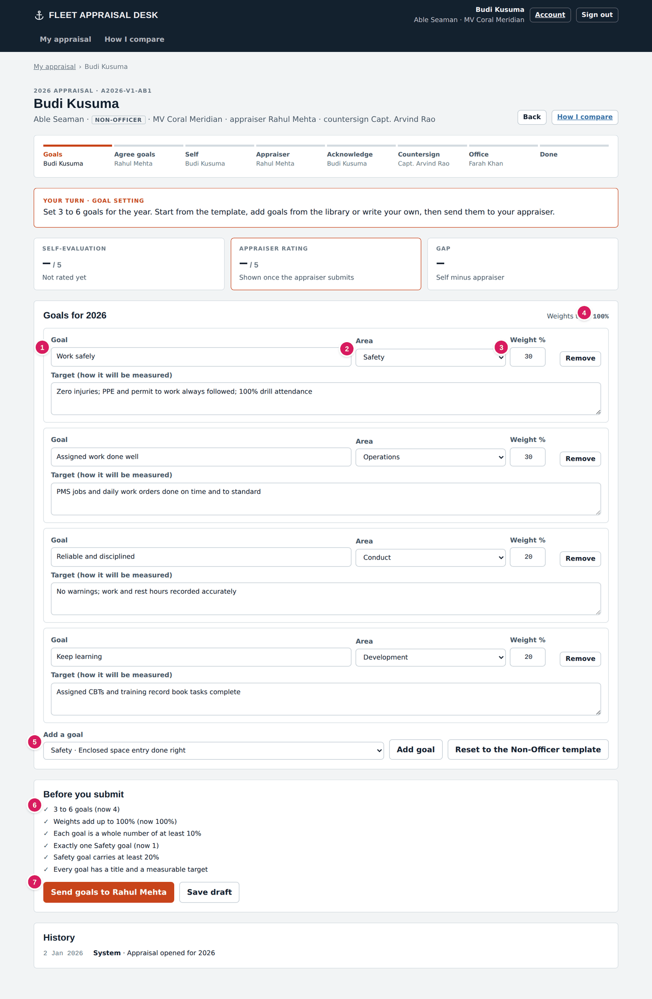</p>

<p align="center"><em>Figure 6: SC-04 Goal editor for an Able Seaman (Non-Officer template)</em></p>

| # | What it is |
| --- | --- |
| 1 | Goal title (max 120 characters). |
| 2 | Area: Safety, Operations, Compliance, Teamwork, Development or Conduct. |
| 3 | Weight in whole percent (10–60, steps of 5 on the spinner; any whole number accepted by typing). |
| 4 | Running weight total; turns green at 100%. |
| 5 | Add a goal from the library (filtered to the seafarer's department and level) or "Write my own goal". A library Safety goal replaces the template Safety goal (only one is allowed). Reset loads the level template again. |
| 6 | Goal checks (BR-03): 3–6 goals; each weight ≥ 10%; total 100%; exactly one Safety goal ≥ 20%; every goal has a title and target. |
| 7 | Send goals to the appraiser (seafarer) or Agree goals (appraiser). Disabled until all checks pass. |

**Table 3: Goal editor actions**

| Action | Who | Result |
| --- | --- | --- |
| Save draft | Seafarer or appraiser | Goals saved; step unchanged |
| Send goals to {appraiser} | Seafarer | Step → Goal agreement (T-03) |
| Agree goals | Appraiser | Goals locked; step → Self-evaluation (T-04) |
| Send back to the seafarer | Appraiser, at Goal agreement | Opens a remark box (required); step → Goal setting (T-05) |

### 2.5 SC-05 Self-evaluation

<p align="center">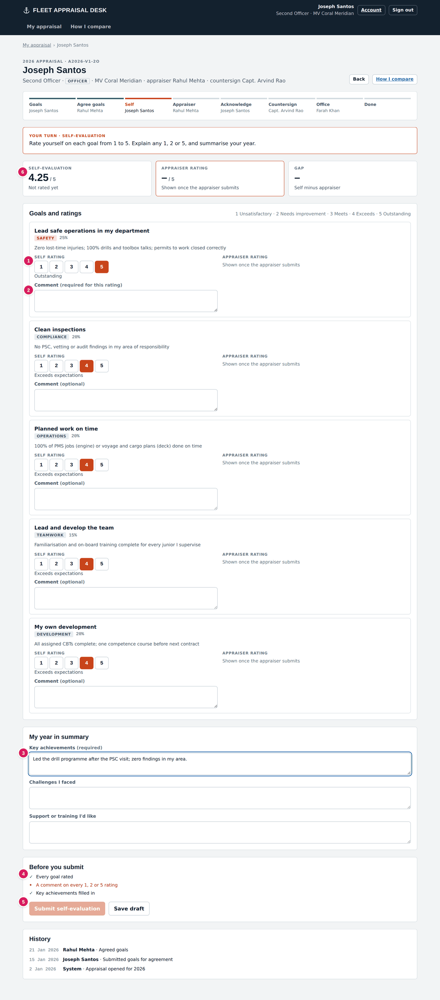</p>

<p align="center"><em>Figure 7: SC-05 Self-evaluation by the Second Officer, part-way through</em></p>

| # | What it is |
| --- | --- |
| 1 | Rating buttons 1–5 with the label shown underneath ("Outstanding"). |
| 2 | Comment; becomes "(required for this rating)" for 1, 2 or 5. |
| 3 | Year summary: key achievements (required), challenges, support or training wanted. |
| 4 | Checklist: every goal rated; comment for each 1, 2 or 5; achievements filled in (BR-05). |
| 5 | Submit self-evaluation; disabled until the checklist is green. |
| 6 | Live self score (weighted overall and band). |

Before submission the appraiser sees "Shown once submitted" in place of the self ratings. After submission the ratings are locked unless the appraiser sends the self-evaluation back.

### 2.6 SC-06 Appraiser evaluation

<p align="center">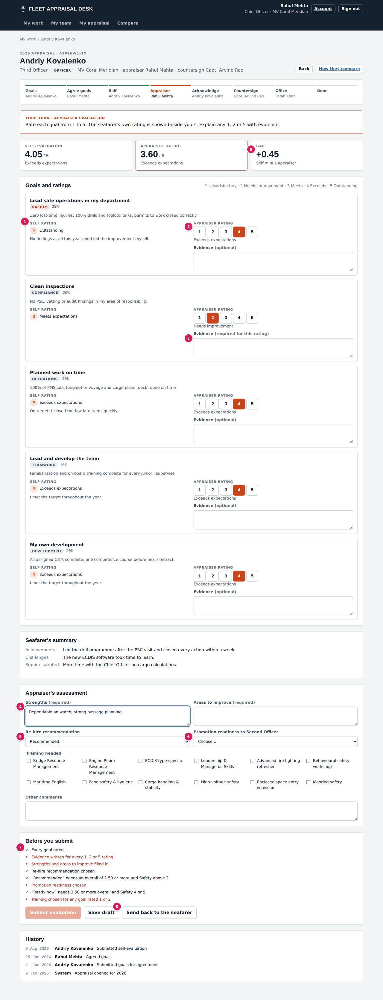</p>

<p align="center"><em>Figure 8: SC-06 Appraiser evaluation by the Chief Officer for the Third Officer</em></p>

| # | What it is |
| --- | --- |
| 1 | The seafarer's own rating and comment, shown beside the appraiser's buttons so differences are visible while rating. |
| 2 | Appraiser rating buttons 1–5. |
| 3 | Evidence; required for 1, 2 or 5 (BR-07). |
| 4 | Strengths and areas to improve (both required). |
| 5 | Re-hire recommendation: Recommended, With reservations, Not recommended. |
| 6 | Promotion readiness to the next rank: Ready now, Ready next year, Not yet ready, Not applicable (ranks without a next rank). |
| 7 | Checklist including BR-08: "Recommended" needs 2.50 and Safety 3+; "Ready now" needs 3.50 and Safety 4+; training required for any goal rated 1 or 2. |
| 8 | Send back to the seafarer (incomplete self-evaluation), with remark. |
| 9 | Gap between self and appraiser, updated live. |

Training is chosen from the course list (12 courses in the demo: Bridge Resource Management, Engine Room Resource Management, ECDIS type-specific, Leadership & Managerial Skills, Advanced fire fighting refresher, Behavioural safety workshop, Maritime English, Food safety & hygiene, Cargo handling & stability, High-voltage safety, Enclosed space entry & rescue, Mooring safety).

### 2.7 SC-07 Acknowledge

<p align="center">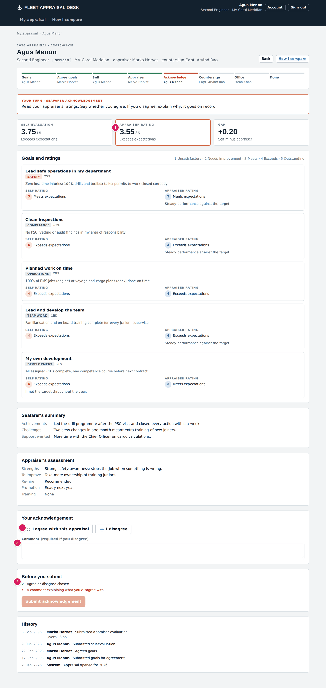</p>

<p align="center"><em>Figure 9: SC-07 Acknowledgement by the Second Engineer, choosing to disagree</em></p>

| # | What it is |
| --- | --- |
| 1 | The appraiser's rating is now visible to the seafarer. |
| 2 | I agree / I disagree. |
| 3 | Comment; required when disagreeing (BR-09). It stays on record and is shown to the countersigner and the office. |
| 4 | Checklist; Submit acknowledgement moves to Countersign, or to Office approval for ranks without a countersigner. |

### 2.8 SC-08 Countersign

<p align="center">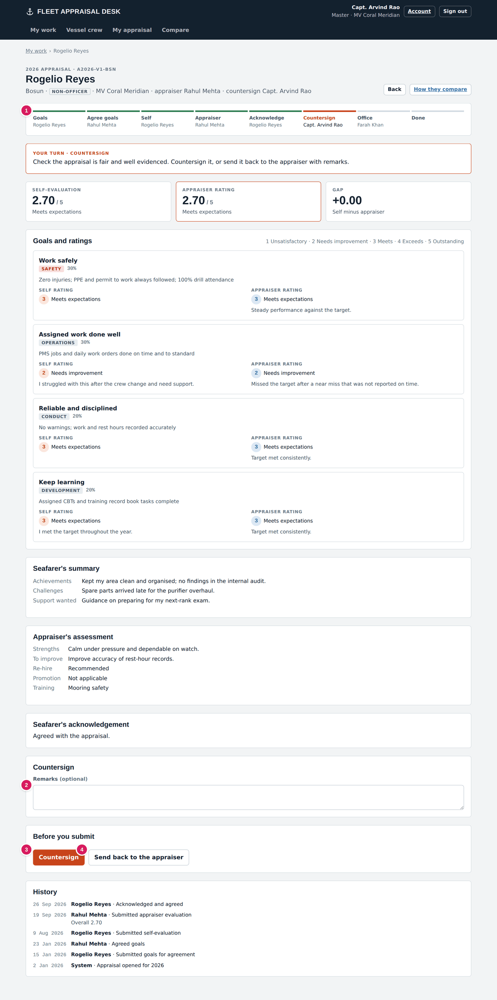</p>

<p align="center"><em>Figure 10: SC-08 Countersign by the Master for the Bosun</em></p>

| # | What it is |
| --- | --- |
| 1 | Stepper shows the countersign step is the Master's. |
| 2 | Optional remarks. |
| 3 | Countersign: step → Office approval. |
| 4 | Send back to the appraiser with a remark: clears acknowledgement and countersign (BR-14). |

### 2.9 SC-09 Office approval

<p align="center">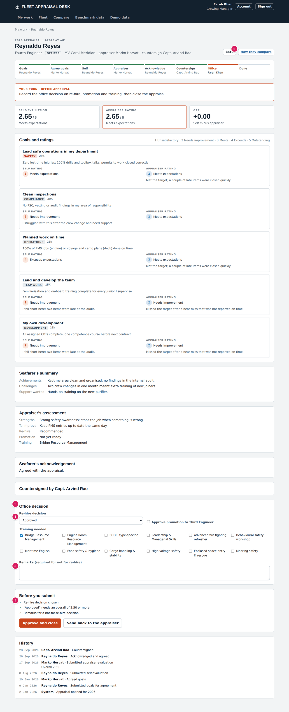</p>

<p align="center"><em>Figure 11: SC-09 Office approval by the Crewing Manager</em></p>

| # | What it is |
| --- | --- |
| 1 | Re-hire decision: Approved, Approved with reservations, Not for re-hire. |
| 2 | Office decision panel: promotion approval (only shown where a next rank exists) and training, pre-filled from the appraiser's choices. |
| 3 | Remarks; required for Not for re-hire. |
| 4 | Checklist (BR-12): decision chosen; "Approved" needs overall ≥ 2.50; remarks for not-for-re-hire. |
| 5 | "How they compare" opens SC-11 for this person, so the decision can be made with the comparison open. |

Approve and close writes re-hire status, promotion and training to the crew record and closes the appraisal. A closed appraisal is read-only for everyone:

<p align="center">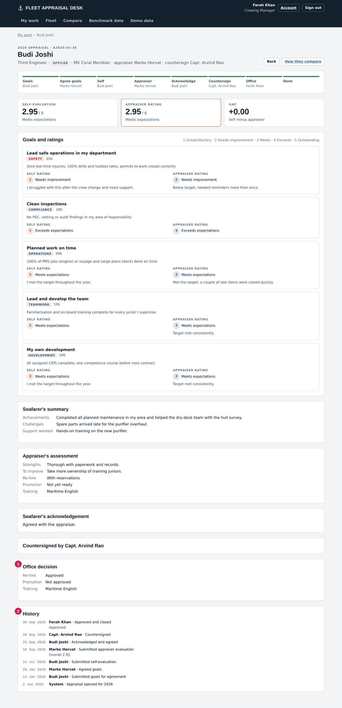</p>

<p align="center"><em>Figure 12: Closed appraisal with the office decision and full history</em></p>

### 2.10 SC-10 Team, vessel crew and fleet list

<p align="center">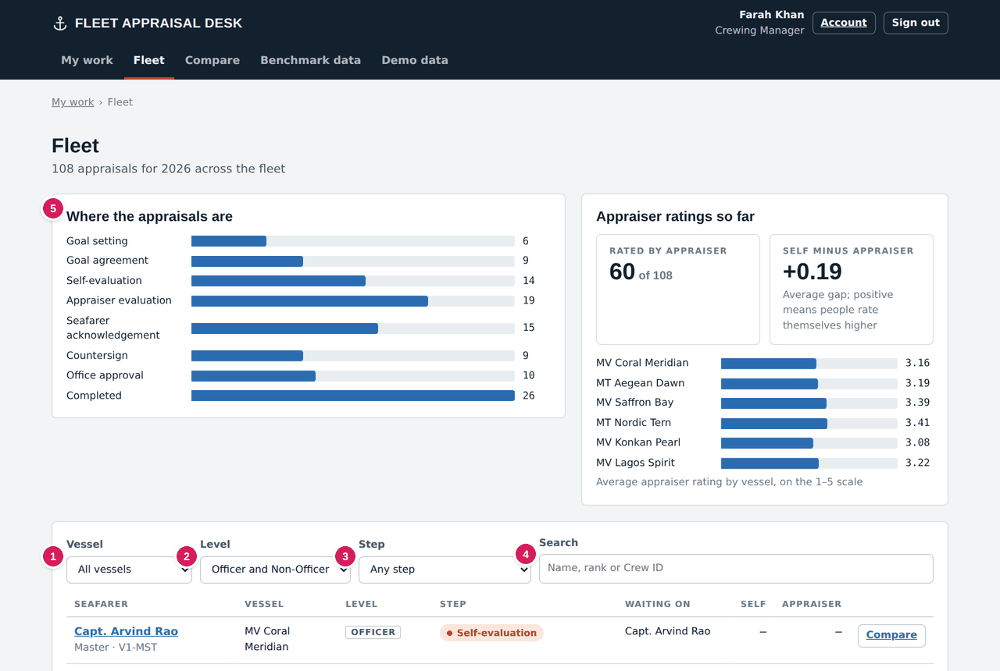</p>

<p align="center"><em>Figure 13: SC-10 Fleet list for the Crewing Manager</em></p>

| # | What it is |
| --- | --- |
| 1 | Vessel filter. |
| 2 | Level filter (Officer, Non-Officer, both). |
| 3 | Step filter. |
| 4 | Search by name or Crew ID. |
| 5 | "Where the appraisals are": count per step, plus average appraiser rating by vessel and the average self–appraiser gap. |

The list shows name, rank, vessel, level, step, who it is waiting on, self and appraiser overall, and a Compare link. Scope follows the role: an HOD sees the people they appraise or countersign, the Master sees their vessel, the office sees the fleet.

### 2.11 SC-11 Compare

Answers "how good is this person compared with others in the same rank, here and at other companies?" The score used is the appraiser's overall once submitted, or a closed result from an earlier year (BR-16).

<p align="center">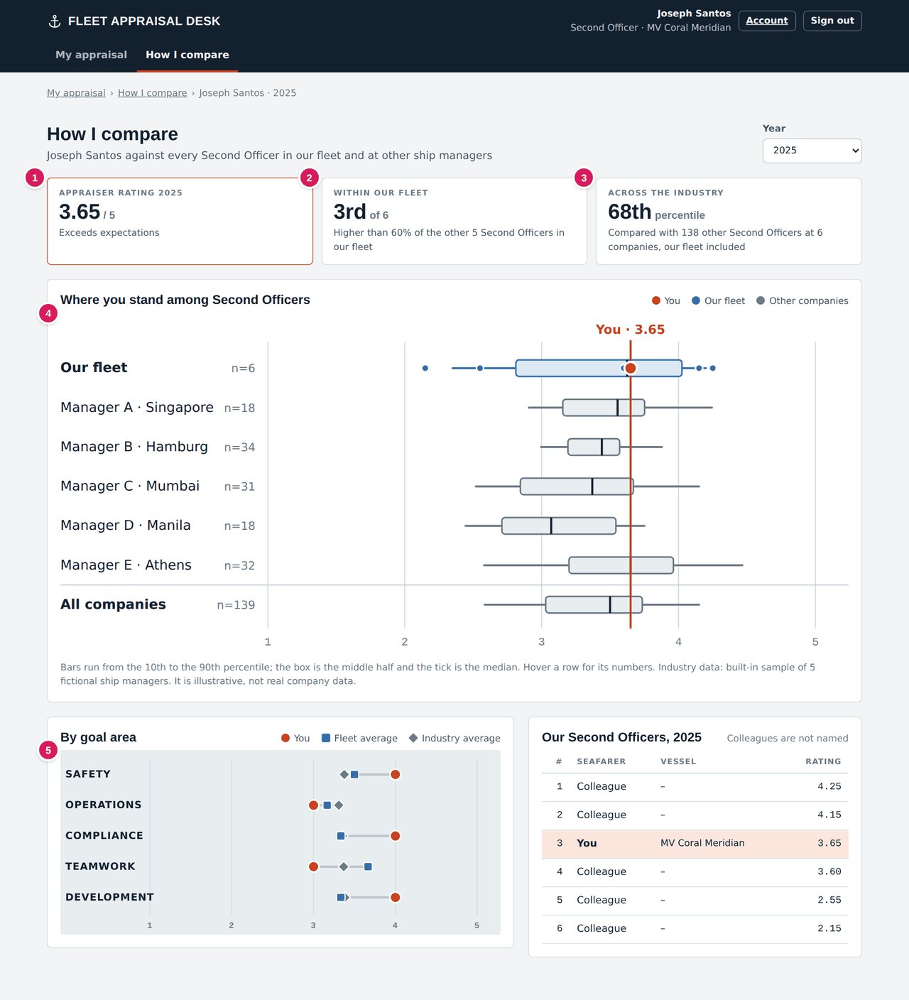</p>

<p align="center"><em>Figure 14: SC-11 How I compare, as the seafarer (2025 result)</em></p>

| # | What it is |
| --- | --- |
| 1 | Appraiser rating for the year and band. |
| 2 | Within our fleet: position (e.g. 3rd of 7) and "higher than x% of the other n". |
| 3 | Across the industry: percentile among the same rank at all companies, with the group size. |
| 4 | Distribution chart: for our fleet, each benchmark company and all companies — 10th–90th percentile whiskers, the middle half as a box, the median line, and "You" as a vertical marker. |
| 5 | By goal area: the person against fleet and industry averages. |

The seafarer's fleet ranking lists colleagues as "Colleague" without names or vessels; the server never sends their names (BR-16, privacy).

<p align="center">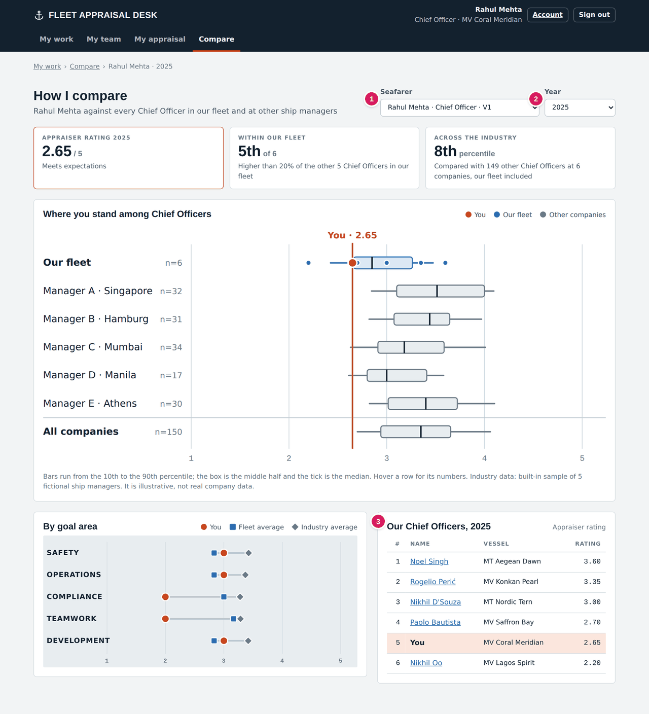</p>

<p align="center"><em>Figure 15: SC-11 Compare as the Chief Officer: named ranking of his team</em></p>

| # | What it is |
| --- | --- |
| 1 | Person selector (people in the viewer's scope). |
| 2 | Year selector (2025 closed results, 2026 in progress). |
| 3 | Named fleet ranking for managers, with the selected person highlighted. |

<p align="center">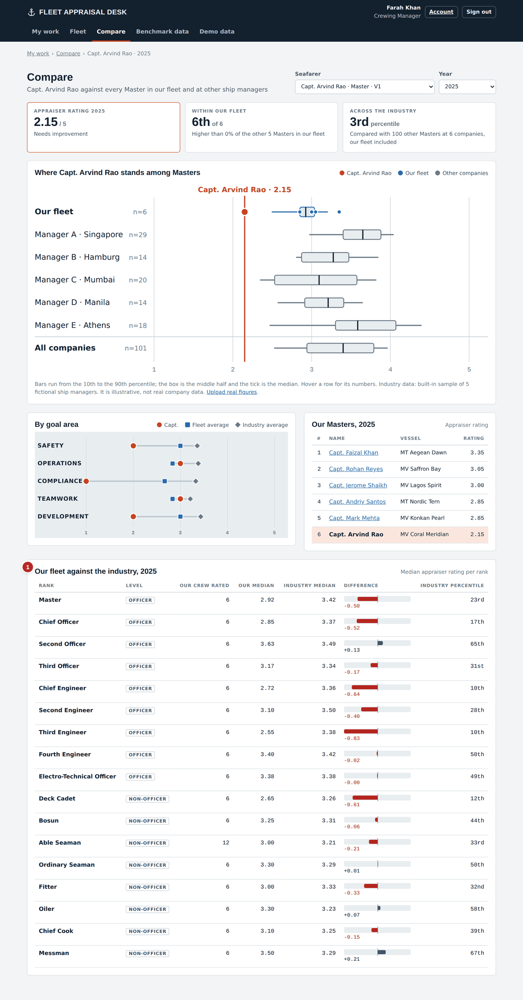</p>

<p align="center"><em>Figure 16: SC-11 Fleet against industry by rank (office only)</em></p>

Fleet against industry lists every rank with our crew count, our median, the industry median, the difference (bar left = we rate lower, right = higher) and our percentile in the industry. Clicking a rank opens that rank's crew. It shows the Crewing Manager where the fleet rates harshly or generously.

### 2.12 SC-12 Benchmark data

<p align="center">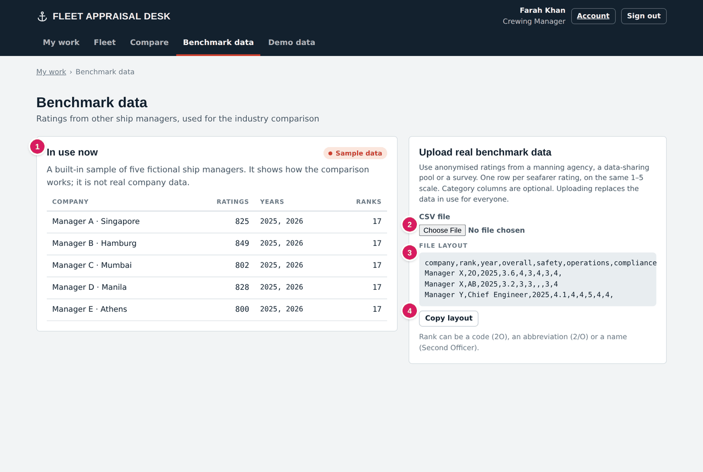</p>

<p align="center"><em>Figure 17: SC-12 Benchmark data in use (sample)</em></p>

| # | What it is |
| --- | --- |
| 1 | Data in use: source name, upload date, sample flag, and per-company counts of ratings, years and ranks. |
| 2 | CSV file upload. |
| 3 | File layout to follow, with a Copy button. |
| 4 | Copy layout. |

<p align="center">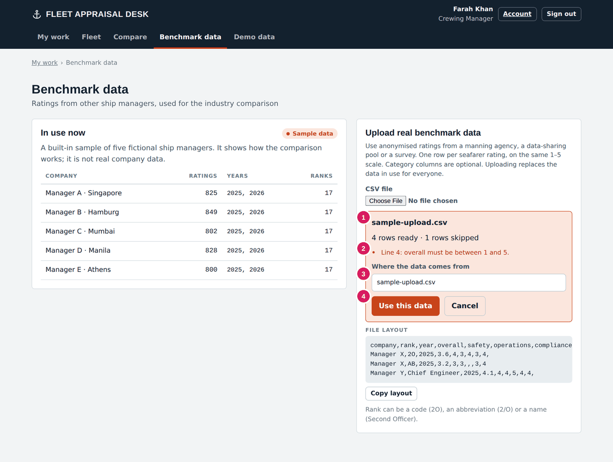</p>

<p align="center"><em>Figure 18: SC-12 After choosing a file: rows ready, rows skipped with reasons, source name, and confirm</em></p>

| # | What it is |
| --- | --- |
| 1 | File name and number of rows ready. |
| 2 | Rows skipped, each with the line number and reason (BR-17). |
| 3 | Where the data comes from: shown on every comparison afterwards. |
| 4 | Use this data replaces the active benchmark for everyone; "Go back to the sample data" appears once real data is in use. |

### 2.13 SC-13 Account and SC-14 Demo data

<p align="center">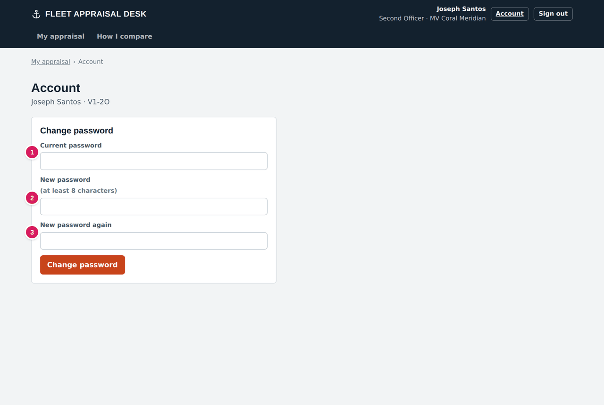</p>

<p align="center"><em>Figure 19: SC-13 Account: change password</em></p>

| # | What it is |
| --- | --- |
| 1 | Current password. |
| 2 | New password (at least 8 characters). |
| 3 | New password again; must match. |

<p align="center">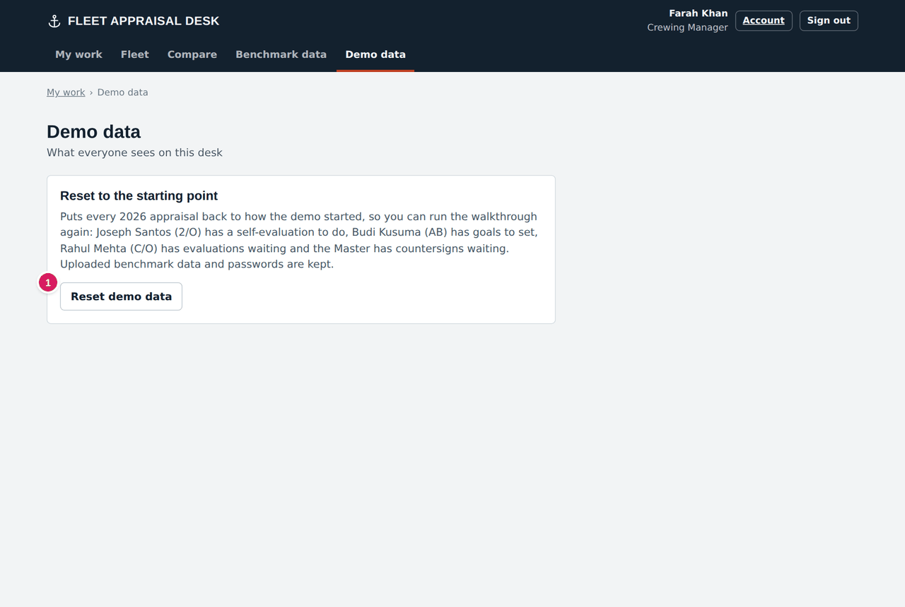</p>

<p align="center"><em>Figure 20: SC-14 Demo data reset (Crewing Manager, demo installations only)</em></p>

Reset is offered only when `Demo:AllowReset=true`; it asks for confirmation, then restores every appraisal, benchmark and prior result to the starting state. Passwords are not reset.

<p align="center">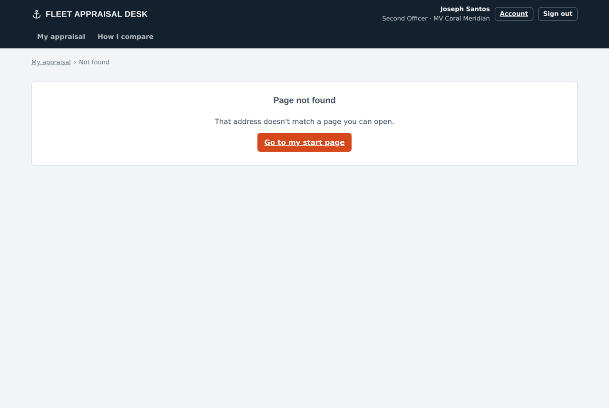</p>

<p align="center"><em>Figure 21: Page not found: shown for unknown links and for pages the role may not open</em></p>

## 3. Business rules

**Table 4: Business rules**

| ID | Rule | Enforced | Message (examples) |
| --- | --- | --- | --- |
| BR-01 | Two levels. Officer: Master, C/O, 2/O, 3/O, C/E, 2/E, 3/E, 4/E, ETO. Non-Officer: every other rank, cadets included. The level picks the goal template. | Reference data | — |
| BR-02 | One appraisal per seafarer per calendar year, opened for everyone in service at the start of the year, or at first sign-on for a joiner, with the level template as draft goals. | Open year / joiner; DB unique key | "Only the office can open appraisals." |
| BR-03 | 3 to 6 goals; each has a title and a measurable target; each weight a whole % of at least 10; weights total 100; exactly one Safety goal of at least 20%. | Send, agree | "Weights must add up to 100% (now 95%)." "Exactly one Safety goal is required (now 2)." |
| BR-04 | The seafarer sends the goals; the appraiser agrees them or sends them back. The appraiser may edit and agree directly while goals are being set. Agreed goals are locked. | Workflow | "Only the appraiser (V1-CO) can agree these goals." |
| BR-05 | Self-evaluation: every goal rated 1–5; a comment for any 1, 2 or 5; key achievements filled in. | Submit self | "Explain your rating of 5 for 'Clean inspections'." "Fill in your key achievements." |
| BR-06 | The appraiser sees self ratings only once submitted; the seafarer, Master and others see appraiser ratings only once the appraiser submits. | Every response | (data omitted) |
| BR-07 | Appraiser evaluation: every goal rated 1–5; evidence for any 1, 2 or 5; strengths and areas to improve; re-hire and promotion chosen. The appraiser can send an incomplete self-evaluation back. | Submit evaluation | "Give evidence for the rating of 2 on 'Clean inspections'." |
| BR-08 | "Recommended" needs overall ≥ 2.50 and Safety ≥ 3. "Ready now" needs overall ≥ 3.50, Safety 4 or 5, and a next rank; ranks with no next rank take "Not applicable". Training required when any goal is rated 2 or below. | Submit evaluation | "'Ready now' needs 3.50 or more overall and Safety 4 or 5." |
| BR-09 | The seafarer acknowledges; disagreeing needs a comment, which stays on record. | Acknowledge | "Explain what you disagree with." |
| BR-10 | Approval chain per rank (03 Workflow Specification, section 3). Onboard roles resolve to whoever holds the rank on the vessel. | Workflow | — |
| BR-11 | The countersigner countersigns with optional remarks or sends it back to the appraiser. Ranks without a countersigner go from acknowledgement to office approval. | Workflow | — |
| BR-12 | An office decision is required; "Approved" needs overall ≥ 2.50; "Not for re-hire" needs remarks; promotion only where a next rank exists. On close, re-hire status, promotion and training are written to the crew record. | Approve | "Give remarks for a not-for-re-hire decision." |
| BR-13 | Overall = Σ(rating × weight) ÷ Σ(weights of rated goals), to 2 decimals (half away from zero). Bands: 4.50+ Outstanding, 3.50+ Exceeds, 2.50+ Meets, 1.50+ Needs improvement, below Unsatisfactory. | Calculation | — |
| BR-14 | Every send-back needs a remark. A send-back to the appraiser clears acknowledgement and countersign. | Return commands | "Say what needs to change before sending it back." |
| BR-15 | Only the person whose step it is can act; others are refused. | Every command | "A2026-V1-2O is not waiting for you." |
| BR-16 | Comparison uses the appraiser's overall once submitted (step Ack or later) or a closed earlier-year result. Fleet rank, "higher than" and industry percentile exclude the person's own score; groups with fewer than four others are flagged. Seafarers see only their own comparison, without colleagues' names. | Comparison | — |
| BR-17 | Benchmark CSV needs columns company, rank, year, overall (1–5); category columns optional. Bad rows are skipped and listed. Only the Crewing Manager can replace the data; the sample data is labelled illustrative. | Upload | "Line 4: overall must be between 1 and 5." "Column 'rank' is missing from the first row." |
| BR-18 | Every step is recorded with date, person, action and note; history cannot be edited. | Every command | — |

## 4. Data dictionary

### 4.1 Appraisal (one per seafarer per year)

**Table 5: Appraisal fields**

| Field | Type | Rule |
| --- | --- | --- |
| Appraisal ID | Text A{year}-{Crew ID} | System |
| Seafarer, rank, level, vessel | Reference | Level from rank (BR-01); rank and vessel as at opening |
| Year | Integer | Unique per seafarer (BR-02) |
| Step | Goals, GoalsReview, Self, Appraiser, Ack, Reviewer, Office, Done | 03 Workflow Specification |
| Achievements, challenges, support wanted | Text ≤ 1,000 | Achievements required (BR-05) |
| Strengths, areas to improve | Text ≤ 1,000 | Required (BR-07) |
| Re-hire recommendation | Recommended, WithReservations, NotRecommended | BR-07, BR-08 |
| Promotion readiness | ReadyNow, ReadyNextYear, NotYetReady, NotApplicable | BR-07, BR-08 |
| Training (appraiser) | List of course names | Required when any goal ≤ 2 (BR-08) |
| Appraiser comment | Text | Optional |
| Seafarer agrees, comment | Boolean, text | Comment required to disagree (BR-09) |
| Countersign remarks | Text | Optional (BR-11) |
| Office decision | Approved, ApprovedWithReservations, NotForRehire | BR-12 |
| Promotion approved, office training, remarks | Boolean, list, text | BR-12 |
| History | List of {date, by, action, note} | Append-only (BR-18) |
| Updated | Date | System |

### 4.2 Goal (3–6 per appraisal)

**Table 6: Goal fields**

| Field | Type | Rule |
| --- | --- | --- |
| Goal ID | g1…g6 | System |
| Title | Text ≤ 120 | Required (BR-03) |
| Area | Safety, Operations, Compliance, Teamwork, Development, Conduct | Exactly one Safety (BR-03) |
| Target | Text ≤ 300 | Required (BR-03) |
| Weight | Whole % | ≥ 10; total 100; Safety ≥ 20 (BR-03) |
| Self rating, self comment | 1–5, text ≤ 500 | Comment for 1, 2, 5 (BR-05) |
| Appraiser rating, evidence | 1–5, text ≤ 500 | Evidence for 1, 2, 5 (BR-07) |

### 4.3 Crew record fields written on approval

| Field | Written from |
| --- | --- |
| Re-hire status | Office decision |
| Promotion approved to | Next rank, when promotion approved |
| Training assigned | Office training list, with the date assigned |
| Last appraisal result | Year, overall, band |

## 5. Calculations

### 5.1 Overall rating and band (BR-13)

```
overall = round( Σ (rating_i × weight_i) / Σ weight_i , 2 )   over goals that have a rating
band    = Outstanding        if overall ≥ 4.50
          Exceeds            if overall ≥ 3.50
          Meets              if overall ≥ 2.50
          Needs improvement  if overall ≥ 1.50
          Unsatisfactory     otherwise
gap     = self overall − appraiser overall
```

Worked example (Second Officer): weights 25/20/20/15/20, appraiser ratings 4/2/4/4/4 → (100 + 40 + 80 + 60 + 80) ÷ 100 = **3.60, Exceeds expectations**. Self ratings 5/4/4/4/4 → 4.25; gap +0.65.

### 5.2 Comparison (BR-16)

For a person with overall *x* in a given rank and year:

```
others        = everyone rated in the same rank and year, with the person's own score removed once
fleet rank    = 1 + count(fleet others with score > x)
higher than   = count(fleet others with score < x) / count(fleet others)
industry pct  = ( count(all others < x) + ½ · count(all others = x) ) / count(all others)
                where "all" = benchmark ratings + our fleet
small group   = count(fleet others) < 4
quantiles     = linear interpolation (as Excel PERCENTILE.INC) for 10th, 25th, 50th, 75th, 90th
percentages   rounded half up to whole numbers
```

**Worked example (Rahul Mehta, Chief Officer, 2025).** Our six Chief Officers scored 3.60, 3.35, 3.00, 2.70, 2.65 (Rahul) and 2.20. Four scored higher, so he is **5th of 6**. Of the other five, one (2.20) scored lower: **higher than 20%**. The industry percentile uses the same rule across all companies' Chief Officers.

> [!NOTE]
> **Why the person is excluded from their own group**
>
> An earlier version counted the person as one of their own peers, so Rahul showed "higher than 25%" instead of "higher than 20% of the other 5". The fix was applied in the browser model and the .NET engine and is verified on all 216 person-years (TC-18).

### 5.3 Benchmark file layout (BR-17)

```
company,rank,year,overall,safety,operations,compliance,teamwork,development,conduct
Manager X,2O,2025,3.6,4,3,4,3,4,
Manager X,AB,2025,3.2,3,3,,,3,4
Manager Y,Chief Engineer,2025,4.1,4,4,5,4,4,
```

Rank may be a code (2O), an abbreviation (2/O) or a name (Second Officer). Each row is one anonymised seafarer rating; no names or IDs are uploaded. Category columns are optional and feed the goal-area comparison.

## 6. Configuration

**Table 7: Thresholds (AppraisalSettings / appr.Setting)**

| Setting | Default | Used by |
| --- | --- | --- |
| Appraisal period | Calendar year | BR-02 |
| Goals per appraisal | 3 to 6 | BR-03 |
| Minimum goal weight / Safety weight | 10% / 20% | BR-03 |
| Ratings needing a comment | 1, 2, 5 | BR-05, BR-07 |
| "Recommended" | overall 2.50+, Safety 3+ | BR-08 |
| "Ready now" | overall 3.50+, Safety 4+ | BR-08 |
| Training required at or below | 2 | BR-08 |
| Office "Approved" | overall 2.50+ | BR-12 |
| Small comparison group | fewer than 4 others | BR-16 |

Templates, the goal library, training courses, ranks and the approval chain are reference tables maintained by the HR administrator (05 Technical Design, data model).

## 7. System messages

**Table 8: Messages**

| Situation | Message shown |
| --- | --- |
| Wrong ID or password | That Crew ID or password is wrong. |
| Session expired | Your session ended. Please sign in again. |
| Not your step | {id} is not waiting for you. |
| Appraisal moved on while open | This appraisal has moved on since you opened it. Showing the latest version. |
| Unknown link or page not allowed | Page not found. That address doesn't match a page you can open. |
| Server error | Something went wrong on the server. Try again; if it keeps happening, tell the system administrator. |
| Password too short | Use at least 8 characters for the new password. |
| Current password wrong | Your current password is wrong. |

---

← [03 Workflow Specification](03_Workflow_Specification.md) · [Index](README.md) · [05 Technical Design Document](05_Technical_Design_Document.md) →
