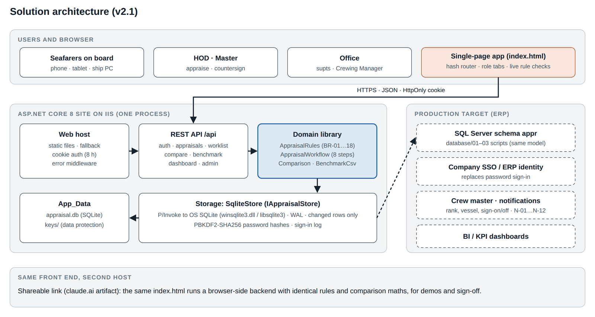

# 05 Technical Design Document

*Architecture, code structure, domain model, workflow engine, storage and database design, API contract, security, comparison algorithm, front-end design, quality attributes and design decisions.*

| | |
| --- | --- |
| Document ID | FAD-05 |
| Version | 2.1 · 3 October 2026 |
| Author | Yasin Jariwala |
| Audience | Engineering reviewers and architects |

**Purpose.** Explains how the module is built and why, so that an engineer can run, change, review or port it (for example into a maritime ERP platform) with confidence.

← [04 Functional Specification](04_Functional_Specification.md) · [Index](README.md) · [06 Test Plan and Test Report](06_Test_Plan_and_Test_Report.md) →

<details><summary><strong>Contents</strong></summary>

- [1. Architecture overview](#1-architecture-overview)
- [2. Technology stack](#2-technology-stack)
- [3. Code structure](#3-code-structure)
- [4. Domain model](#4-domain-model)
   - [4.1 Workflow engine](#41-workflow-engine)
- [5. Storage and database](#5-storage-and-database)
   - [5.1 SQLite store (v2.1)](#51-sqlite-store-v21)
   - [5.2 SQL Server schema (production path)](#52-sql-server-schema-production-path)
- [6. API contract](#6-api-contract)
   - [6.1 Errors](#61-errors)
   - [6.2 Example: a seafarer's comparison](#62-example-a-seafarers-comparison)
- [7. Security and privacy](#7-security-and-privacy)
- [8. Comparison engine](#8-comparison-engine)
- [9. Front-end design](#9-front-end-design)
- [10. Quality attributes](#10-quality-attributes)
- [11. Design decisions](#11-design-decisions)

</details>

---

## 1. Architecture overview

The module is one ASP.NET Core 8 web application. It serves a single-page front end and a REST API from the same process, so IIS hosts one site. All business rules live in a separate, dependency-free domain library; the API is a thin layer that authenticates the caller, loads the appraisal, calls the domain, saves and shapes the response for what the caller may see.

<p align="center"></p>

<p align="center"><em>Figure 1: Solution architecture</em></p>

**Table 1: Design principles**

| Principle | How it shows up |
| --- | --- |
| Rules in one place | Every BR-nn is implemented once in `AppraisalRules` / `AppraisalWorkflow`; the screen shows the same checks for guidance, but the server decides. |
| Server decides what you can see | BR-06 and the seafarer comparison privacy are applied when building responses, not by hiding fields in the browser. |
| Thin, replaceable edges | Storage behind `IAppraisalStore`; identity behind a cookie scheme that SSO can replace; front end talks only JSON. |
| Low bandwidth first | One HTML file loaded once, compressed JSON, no third-party scripts or fonts required. |
| Builds anywhere | No NuGet packages: SQLite through the operating system library, a self-contained test runner. |

## 2. Technology stack

**Table 2: Stack**

| Concern | Choice | Version / notes |
| --- | --- | --- |
| Runtime | .NET | 8 (LTS); framework-dependent publish |
| Web | ASP.NET Core minimal API | Cookie authentication, response compression, static files |
| Hosting | IIS with ASP.NET Core Module V2, in-process | `web.config` included; Kestrel for development |
| Database (pilot) | SQLite 3 via P/Invoke | `winsqlite3.dll` (Windows 10+/Server 2016+), `libsqlite3.so.0` (Linux); WAL journal |
| Database (production path) | SQL Server | Schema `appr`: 16 tables, 4 views (`database/01_schema.sql`) |
| Password hashing | PBKDF2-SHA256 | `Rfc2898DeriveBytes.Pbkdf2`, 100,000 iterations, 16-byte salt, 32-byte hash |
| Front end | HTML, CSS, vanilla JavaScript | About 1,230 lines across 7 source files, built into one `index.html` (135 KB) |
| Tests | Self-contained C# runner; bash + curl; Playwright | 28 + 31 + 27 checks |

## 3. Code structure

**Table 3: Code map**

| Project / folder | Contents |
| --- | --- |
| `src/Maritime.Appraisal.Domain` | `Reference.cs`: ranks, approval chain, rating scale, templates, goal library, training, `AppraisalSettings`. `Entities.cs`: `SeafarerAppraisal`, `Goal`, `SelfSummary`, `Assessment`, `Acknowledgement`, `ReviewerSignOff`, `OfficeDecision`, `PriorResult`, `BenchmarkRating`, `Stage`. `AppraisalRules.cs`: scoring and every validation rule. `AppraisalWorkflow.cs`: commands and queries for the 8 steps, scope and visibility. `Comparison.cs`: fleet and industry comparison, quantiles, benchmark CSV reader. |
| `src/Maritime.Appraisal.Api` | `Program.cs`: hosting, authentication, endpoints, DTO shaping, error middleware. `Storage/Sqlite.cs`: native SQLite wrapper. `Storage/SqliteStore.cs`: `IAppraisalStore` on SQLite, passwords. `InMemoryStore.cs`: demo data loader. `DemoData/`: `fleet.json`, `benchmark-sample.json`. `wwwroot/index.html`: the front end. `web.config`, `appsettings.json`. |
| `tests/Maritime.Appraisal.Tests` | TC-01 to TC-28 and `expected-comparison.json` (216 independent results). |
| `tests/api-smoke.sh` | 31 HTTP checks against a fresh database. |
| `tests/e2e/e2e.js` | Playwright browser test (27 checks on the server, 23 on the shareable link). |
| `database/` | SQL Server schema, reference data and demo data scripts. |
| `publish/` | Release build ready to copy to IIS. |

Size: about 1,850 lines of C# (domain, API, storage, tests) and 1,230 lines of front-end JavaScript.

## 4. Domain model

**Table 4: Domain entities**

| Entity | Key properties | Notes |
| --- | --- | --- |
| `SeafarerAppraisal` | Id, SeafarerId, Year, RankCode, VesselId, Stage, Goals, SelfSummary, Assessment, Ack, Reviewer, Office, History, Updated | Aggregate root; one per seafarer per year |
| `Goal` | Id, Title, Category, Target, Weight, SelfRating, SelfNote, AppraiserRating, AppraiserNote | 3–6 per appraisal |
| `Assessment` | Strengths, Improvements, Rehire, Promotion, Training, Comment | Appraiser's Level 2 recommendation |
| `Acknowledgement` | Agrees, Comment | BR-09 |
| `OfficeDecision` | Decision, PromotionApproved, Training, Remarks | BR-12 |
| `HistoryEntry` | On, By, Action, Note | Append-only (BR-18) |
| `Seafarer` | Id, Name, RankCode, VesselId, RehireStatus, PromotionApprovedTo, Training | Crew record fields written on approval |
| `RankInfo` | Code, Name, Department, Level, Appraiser, Reviewer, NextRank | Reference; drives the chain |
| `PriorResult` | SeafarerId, Year, Overall, category ratings | Closed earlier-year results |
| `BenchmarkRating` | Company, RankCode, Year, Overall, category ratings | Anonymised; no personal data |

### 4.1 Workflow engine

`AppraisalWorkflow` exposes one method per command (SaveGoals, SubmitGoals, AgreeGoals, ReturnGoals, SaveSelf, SubmitSelf, SaveEvaluation, ReturnSelf, SubmitEvaluation, Acknowledge, Countersign, ReturnToAppraiser, Approve, OpenYear, OpenForJoiner) and the queries Get, Worklist, CanView, InScope, SeesSelfRatings, SeesAppraiserRatings. Every command follows the same pattern:

```
public SeafarerAppraisal SubmitSelf(Actor u, string id)
{
    var a = Get(id);                                   // 404 if unknown
    RequireStep(u, a, Stage.Self, a.SeafarerId);       // 409 wrong step, 403 not your step (BR-15)
    Fail(AppraisalRules.SelfErrors(a));                // 422 with BR-05 messages
    return Move(a, u, Stage.Appraiser,                 // stage change + history entry (BR-18)
                "Submitted self-evaluation");
}
```

The actor for each step is computed, not stored: `ActorFor(a)` returns the seafarer for Goals/Self/Ack, the appraiser for GoalsReview/Appraiser, the countersigner for Reviewer and the Crewing Manager for Office. Onboard roles resolve to the seafarer holding that rank on the vessel today (`Resolve(role, vesselId)`), which is why a relieving Chief Officer inherits open appraisals automatically.

## 5. Storage and database

### 5.1 SQLite store (v2.1)

`SqliteStore` implements `IAppraisalStore`. Aggregates are stored as JSON documents with indexed key columns, which keeps the schema stable while the model evolves and makes a later move to SQL Server a mapping exercise rather than a redesign.

**Table 5: SQLite tables**

| Table | Columns | Purpose |
| --- | --- | --- |
| meta | key, value | Schema version, seed information |
| vessels | id, json | Vessels |
| shore_users | code, json | Office users (MSUPT, TSUPT, CREWING, ADMIN) |
| seafarers | id, rank, vessel, json | Crew records |
| appraisals | id, seafarer_id, year, stage, updated, json; unique (seafarer_id, year) | Appraisals (BR-02 enforced by the index) |
| prior_results | seafarer_id, year, overall, json | Closed earlier results |
| benchmark | id, company, rank, year, overall, json; index (rank, year) | Benchmark ratings |
| users | user_id, salt, hash, must_change, last_login | Credentials |
| sign_in_log | id, user_id, at, ok | Sign-in audit |

- **Write path**: commands run under a process-wide lock; `SaveChanges()` compares each aggregate's JSON with what was last saved and writes only changed rows inside one `BEGIN IMMEDIATE` transaction.
- **Journal**: WAL mode, so reads never block on writes; busy timeout 5 s.
- **First run**: `Initialise()` creates tables; if the database is empty and `Demo:SeedDemoData` is true, the demo fleet is loaded; passwords are seeded for any user without one.
- **Library loading**: a `NativeLibrary` resolver tries `sqlite3`, then `winsqlite3` on Windows, and `libsqlite3.so.0` on Linux, so no package is needed.

### 5.2 SQL Server schema (production path)

**Table 6: SQL Server schema appr (16 tables, 4 views)**

| Object | Key columns | Notes |
| --- | --- | --- |
| appr.Rank | RankCode, Level, AppraiserRole, ReviewerRole, NextRankCode | Level (BR-01) and chain (BR-10) |
| appr.GoalTemplate, GoalLibrary, TrainingCourse, Setting | — | Reference data kept by HR admin |
| appr.Vessel, ShoreUser, Seafarer | Seafarer: RankCode, VesselId, RehireStatus, PromotionApprovedTo | Crew record updated on approval (BR-12) |
| appr.SeafarerTraining | SeafarerId, TrainingCourseId, AssignedOn, CompletedOn | Training assigned by the office |
| appr.Appraisal | AppraisalId, SeafarerId, AppraisalYear, Stage, summary, assessment, acknowledgement, countersign and office fields | Unique (SeafarerId, AppraisalYear); check constraints for not-for-re-hire remarks and disagreement comment |
| appr.AppraisalGoal | AppraisalId, GoalId, Category, Weight, SelfRating, SelfNote, AppraiserRating, AppraiserNote | Ratings checked 1–5 |
| appr.AppraisalTraining | AppraisalId, TrainingCourseId, Source | Appraiser or office |
| appr.AppraisalHistory | AppraisalId, ActedOn, ActedBy, Action, Note | Append-only (BR-18) |
| appr.PriorResult | SeafarerId, ResultYear, Overall, categories | Comparison history |
| appr.BenchmarkSource, BenchmarkRating | Source, date, sample flag, active flag; company, rank, year, overall, categories | One active source (BR-17) |
| appr.vw_AppraisalScore | — | Self and appraiser overall per appraisal (BR-13) |
| appr.vw_ComparableScore, vw_FleetPosition | — | Comparison score and fleet position (BR-16) |
| appr.vw_StageSummary | — | Dashboard counts |

The SQL scripts parse as T-SQL (41 statements) and carry the same demo data; they have not yet been executed against a live SQL Server instance (see 06, exit criteria).

## 6. API contract

REST over HTTPS, JSON, base path `/api`. Callers sign in with `POST /api/auth/login` and carry an HttpOnly, SameSite=Lax cookie `fad.auth` (8 hours, sliding). Unauthenticated calls get **401** (never a redirect). Responses are compressed (gzip/Brotli).

**Table 7: Endpoints (33 under /api plus /health)**

| Method and path | Who | Purpose |
| --- | --- | --- |
| POST /auth/login · POST /auth/logout · GET /auth/me | Any | Sign in (returns user and mustChangePassword), sign out, current user |
| POST /auth/change-password | Signed-in user | Current + new password (≥ 8 characters) |
| GET /auth/demo-accounts | Anonymous (demo only) | Demo account cards; empty when ShowDemoAccounts=false |
| GET /reference/all · GET /vessels · GET /people | Signed-in | Reference data, vessels, people in scope |
| GET /appraisals?scope=mine\|team&year&vesselId&level&stage | Signed-in (scope) | List with scores the caller may see |
| GET /appraisals/{id} | Allowed viewers | Detail with names map, chain, visibility flags, history |
| POST /appraisals/open-year · POST /appraisals/joiner/{seafarerId} | Office | Open the year or one joiner (BR-02) |
| PUT /appraisals/{id}/goals · POST …/goals/submit · …/goals/agree · …/goals/return | Seafarer, appraiser | Goal steps (BR-03, BR-04, BR-14) |
| PUT /appraisals/{id}/self · POST …/self/submit | Seafarer | Self-evaluation (BR-05) |
| PUT /appraisals/{id}/evaluation · POST …/evaluation/submit · …/evaluation/return | Appraiser | Evaluation (BR-07, BR-08, BR-14) |
| POST /appraisals/{id}/acknowledge | Seafarer | BR-09 |
| POST /appraisals/{id}/countersign · …/return-to-appraiser | Countersigner, office | BR-11, BR-14 |
| POST /appraisals/{id}/approve | Crewing Manager | BR-12 |
| GET /worklist · GET /dashboard | Signed-in · office | What is waiting for me; stage counts and averages |
| GET /compare/{seafarerId}?year | Self, scope, office | Comparison result and ranking (BR-16) |
| GET /compare/fleet-vs-industry?year | Office | Median per rank against the industry |
| GET · POST (text/csv, ?source=) · DELETE /benchmark | Any · Crewing · Crewing | Data in use; upload; back to sample (BR-17) |
| POST /admin/reset-demo | Crewing (AllowReset) | Reset demo data |
| GET /health (outside /api) | Anonymous | Status, database file name, SQLite version, appraisal count |

### 6.1 Errors

**Table 8: Error responses**

| Status | When | Body |
| --- | --- | --- |
| 400 | Malformed request | `{status, message}` |
| 401 | Not signed in or session expired; wrong password | `{status, message}` |
| 403 | Not your step or outside your scope (BR-15) | `{status, message}` |
| 404 | Unknown appraisal, person or `/api` route | `{status, message}` |
| 409 | Appraisal is at a different step | `{status, message}` |
| 422 | A business rule failed | `{status, message, errors[]}` with BR numbers |
| 500 | Unexpected error (logged) | Generic message, no stack trace |

### 6.2 Example: a seafarer's comparison

```
GET /api/compare/V1-2O?year=2025          (signed in as V1-2O)
{ "result": { "seafarerId": "V1-2O", "rankCode": "2O", "year": 2025,
    "overall": 3.65, "band": "Exceeds expectations",
    "fleetRank": 3, "fleetRated": 6, "fleetOthers": 5, "higherThanPctOfFleet": 60,
    "smallGroup": false, "industryPercentile": 68, "industryOthers": 138, "companies": 6,
    "distributions": [ … ], "categories": [ … ],
    "source": { "source": "Sample benchmark: 5 fictional ship managers …", "isSample": true, "rows": 4104 } },
  "ranking": [ { "position": 1, "id": null, "name": null, "vesselName": null, "overall": 4.25, "isPerson": false },
               …,
               { "position": 3, "id": "V1-2O", "name": "Joseph Santos", "overall": 3.65, "isPerson": true } ] }
```

For a seafarer, colleagues' `id`, `name` and `vesselName` are null in the payload itself. For an appraiser, Master or office user the same endpoint returns names.

## 7. Security and privacy

**Table 9: Security controls**

| Threat / need | Control |
| --- | --- |
| Password theft from the database | PBKDF2-SHA256, 100,000 iterations, per-user 16-byte random salt; constant-time comparison |
| Session hijack | HttpOnly, SameSite=Lax cookie; Secure when served over HTTPS; 8-hour sliding expiry; data-protection keys in `App_Data/keys` (not web-served) |
| Acting on someone else's step | Every command checks the step and the caller (BR-15) on the server |
| Seeing ratings too early | Responses omit self ratings until submitted and appraiser ratings until submitted (BR-06) |
| Seafarer learning colleagues' scores | Comparison computed on the server; colleague identities removed from the payload |
| Benchmark leaking personal data | Upload format has no name or ID columns; one row per anonymous rating |
| Tampering with history | History is append-only in code and in the SQL schema design |
| Database file download | `App_Data` is a hidden segment in `web.config`; verified 404 |
| Demo shortcuts in production | `AllowHeaderAuth` (tests only), `ShowDemoAccounts`, `AllowReset`, `SeedDemoData` all switchable; go-live checklist in 07 |
| Brute force | Generic error message; sign-in log; account lockout and rate limiting on the roadmap (or via SSO) |

> [!NOTE]
> **MLC record of employment**
>
> Appraisal data is never printed on the seafarer's record of employment or discharge book; MLC Standard A2.1 1(e) prohibits statements on the quality of work there. N-11 decision emails also leave out the rating.

## 8. Comparison engine

`Comparison.Compare(seafarerId, year)` is a pure function of the store:

1. Find the person's comparable score: appraiser overall at step Ack or later, or a prior result for a closed year. If none, return "not rated yet".
2. Collect fleet scores for the same rank and year the same way; remove the person once to get "others".
3. Collect benchmark ratings for the rank and year from the active source; "all others" = benchmark + fleet others.
4. Compute fleet rank, higher-than share, ties, industry percentile (ties count half), group sizes and the small-group flag.
5. Compute quantiles (10/25/50/75/90, linear interpolation) for our fleet, each company and all companies; and category averages.

```
static double Quantile(double[] sorted, double p)        // PERCENTILE.INC
{
    var h = (sorted.Length - 1) * p; var lo = (int)Math.Floor(h);
    return lo + 1 < sorted.Length ? sorted[lo] + (h - lo) * (sorted[lo + 1] - sorted[lo]) : sorted[lo];
}
industryPct = Round(100 * (below + equal / 2.0) / allOthers, MidpointRounding.AwayFromZero);
```

**Verification**: TC-18 compares overall, fleet rank, rated count, higher-than, industry percentile and group size for every demo seafarer in 2025 and 2026 (216 cases) against `expected-comparison.json`, which was produced by an independent JavaScript implementation. All 216 match.

## 9. Front-end design

**Table 10: Front end**

| Part | Design |
| --- | --- |
| Structure | Seven source files built by `build.sh` into one `index.html`: reference data, core (state, API mappers, two backends), rules (live checks), shell (router, tabs, lists), appraisal page, compare, benchmark/admin/events |
| Routing | Hash links (`#work`, `#app.A2026-V1-2O`, `#compare.V1-2O.2025`). A router parses the hash, checks the user and the role's allowed pages, loads data for that view and renders. `hashchange` drives Back/Forward; unknown or disallowed pages render "Page not found". |
| Deep links | If signed out, the requested page is remembered and opened after sign-in. |
| Two backends, one UI | `ApiBackend` calls the .NET API (IIS). `LocalBackend` runs the same rules and comparison in the browser with the artifact's shared store (shareable link). The UI calls `B.*` and does not know which is active; `window.FAD_API` selects it. |
| Editing | A working copy (`S.edit`) holds unsaved changes with a dirty flag; Save draft PUTs; submit commands POST; a 409 reloads; leaving with unsaved changes asks the browser to confirm. |
| Live checks | The same rule list as the server (goal, self, appraiser, acknowledgement, office checks) renders the "Before you submit" list and enables the button. |
| Charts | Inline SVG drawn by code (box-and-whisker by company, goal-area dot plot, fleet-vs-industry bars); no chart library. |
| Accessibility | Semantic buttons and labels, focus styles, `aria-current` on tabs, `role="alert"` on server errors, contrast checked in light and dark themes. |

## 10. Quality attributes

**Table 11: Quality attributes**

| Attribute | Measured / designed |
| --- | --- |
| Performance | Server time 1–3 ms per call on the demo fleet; first start (hashing 112 account passwords: 108 seafarers and 4 office users) about 10 s, later starts under 1 s |
| Payload | App 135 KB (49 KB compressed), appraisal 2 KB, fleet list 37 KB (4.6 KB compressed) |
| Scalability | Single-process SQLite comfortably serves one ship manager (hundreds of vessels, thousands of appraisals per year). Multi-tenant SaaS scale moves to SQL Server and a stateless API behind a load balancer. |
| Availability | Stateless except the database file; IIS restarts the app on failure; `/health` for monitoring |
| Maintainability | Rules in one library with 28 tests; reference data drives ranks, chain and thresholds |
| Portability | Windows and Linux; no package downloads needed to build |

## 11. Design decisions

**Table 12: Architecture decision records**

| ID | Decision | Alternatives considered | Reason |
| --- | --- | --- | --- |
| ADR-01 | One dependency-free domain library for all rules | Rules in controllers; rules in stored procedures | Testable, reusable from API, vessel copy or ERP services; one source of truth |
| ADR-02 | SQLite through the OS library for the pilot | SQL Server from day one; EF Core + NuGet SQLite | Zero-install database for a pilot; NuGet unavailable in the build environment; SQL scripts kept for production |
| ADR-03 | Store aggregates as JSON with indexed keys | Fully normalised tables | Model changed often during design; normalised schema provided for SQL Server |
| ADR-04 | Cookie authentication with PBKDF2 passwords | JWT; SSO only | Simple and secure for a single-site app; SSO can replace it without touching rules |
| ADR-05 | Vanilla JS single-page app with hash routing | React/Angular SPA; server-rendered pages | One small file for satellite links; same file runs on IIS and as the shareable link; no build chain |
| ADR-06 | Server-side comparison with identity stripping for seafarers | Send all scores and hide in the UI | Privacy cannot depend on the browser |
| ADR-07 | Compute the step actor from rank and vessel | Store named appraiser on each appraisal | Relievers inherit open appraisals automatically; matches how ships work |
| ADR-08 | Exclude the person from their own comparison group | Include everyone | "Higher than x% of others" must not count the person against themselves (found in review, fixed, TC-18) |

---

← [04 Functional Specification](04_Functional_Specification.md) · [Index](README.md) · [06 Test Plan and Test Report](06_Test_Plan_and_Test_Report.md) →
