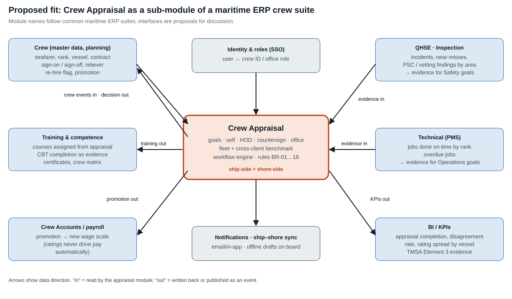

# 09 Maritime ERP Integration and Fit

*How the appraisal module would sit inside a maritime ERP suite: module touchpoints, data contracts and events, ship–shore behaviour, multi-tenant design, a cross-client benchmark product, migration and rollout.*

| | |
| --- | --- |
| Document ID | FAD-09 |
| Version | 2.1 · 3 October 2026 |
| Author | Yasin Jariwala |
| Audience | Product, architecture and leadership reviewers of maritime ERP platforms |

**Purpose.** Shows how the module would become a feature of a ship-management ERP. Module names are generic to the category; interfaces described here are proposals for discussion.

← [08 Release Notes](08_Release_Notes.md) · [Index](README.md) · [10 Decisions, Assumptions, Risks and Roadmap](10_Decisions_Assumptions_Risks_and_Roadmap.md) →

<details><summary><strong>Contents</strong></summary>

- [1. Why the module fits a maritime ERP](#1-why-the-module-fits-a-maritime-erp)
- [2. Placement in the product](#2-placement-in-the-product)
- [3. Integration touchpoints](#3-integration-touchpoints)
   - [3.1 Evidence beside ratings](#31-evidence-beside-ratings)
- [4. Data contracts](#4-data-contracts)
- [5. Ship–shore behaviour](#5-shipshore-behaviour)
- [6. Multi-tenant design](#6-multi-tenant-design)
- [7. Product opportunity: a cross-client benchmark](#7-product-opportunity-a-cross-client-benchmark)
- [8. Migration and rollout with a client](#8-migration-and-rollout-with-a-client)
- [9. Questions to settle with an ERP platform team](#9-questions-to-settle-with-an-erp-platform-team)

</details>

---

## 1. Why the module fits a maritime ERP

Ship-management ERP suites typically cover Crew, Crew Accounts / payroll, QHSE, Inspection, Technical (PMS), Procurement, Accounting, Operations, Drydock and BI/KPIs. Their Crew modules usually manage seafarer records, crew planning, rotations, certificates, competence, travel, payroll links and crew-matrix checks. **Performance appraisal is often handled outside the system** — on attached forms or spreadsheets — yet it is the step that decides who is re-hired, promoted and trained: the inputs to crew planning itself.

**Table 1: Fit with a maritime ERP module set**

| Typical ERP strength | What the appraisal module adds |
| --- | --- |
| Crew master data, rotations, sign-on/sign-off | Opens, routes and times appraisals automatically from those events; writes re-hire and promotion back |
| Certificates, competence, crew matrix | A performance view that complements competence: delivery against agreed goals, with evidence |
| QHSE, Inspection, Technical (PMS) | Objective evidence for Safety, Compliance and Operations goals, shown beside the ratings |
| Crew Accounts / payroll | Promotion approvals flow to the next contract's wage scale through existing crew processes |
| BI / KPIs | TMSA Element 3 evidence: completion, disagreement rate, rating spread, retention of top performers |
| Multi-client SaaS platform | An anonymised, opt-in **industry benchmark across clients** — something no single ship manager can build alone |

## 2. Placement in the product

Proposed as a sub-module of **Crew**, called **Crew Appraisal**, with screens in both the shore application and the vessel application.

<p align="center"></p>

<p align="center"><em>Figure 1: Proposed integration context</em></p>

**Table 2: Surfaces**

| Surface | Users | Screens |
| --- | --- | --- |
| Vessel application | Seafarers, HODs, Master | My appraisal, goal editor, self-evaluation, appraiser evaluation, acknowledge, countersign, team list, own comparison |
| Shore application | Superintendents, Crewing, HR | Fleet list, approvals, comparison and fleet against industry, benchmark data, configuration |
| Crew self-service (mobile/web) | Seafarers at home | Goals, self-evaluation, acknowledgement, decision, comparison |
| BI / KPIs | Management, QHSE | Appraisal KPIs and TMSA evidence dashboards |

## 3. Integration touchpoints

**Table 3: Touchpoints**

| # | ERP module | Direction | Data / event | Used for |
| --- | --- | --- | --- | --- |
| I-01 | Crew (master data) | In | Seafarer, rank, department, vessel, nationality-neutral profile | Who is appraised; level (BR-01); chain (BR-10) |
| I-02 | Crew (planning) | In | `SeafarerSignedOn`, `SeafarerSignedOff` (planned and actual), `ReliefAssigned` | Open joiner appraisals (BR-02); due date = last 14 days on board; reassign appraiser on relief |
| I-03 | Crew (planning) | Out | `AppraisalClosed` {re-hire decision, promotion approved to, training} | Re-hire flag and promotion candidate list for crew planning |
| I-04 | Training & competence | Out | `TrainingAssigned` {course, due before next contract} | Training plan; certificate/competence follow-up |
| I-05 | Training & competence | In | CBT and course completions | Evidence for Development goals |
| I-06 | QHSE / Inspection | In | Incidents, near-misses reported, PSC / vetting / audit findings by area and rank | Evidence for Safety and Compliance goals |
| I-07 | Technical (PMS) | In | Jobs due / done on time / overdue by responsible rank | Evidence for Operations goals |
| I-08 | Crew Accounts / payroll | Out (via Crew) | Promotion effective on next contract | New wage scale through the normal contract process; ratings never drive pay directly |
| I-09 | Identity & roles | In | User ↔ Crew ID / office role; vessel assignment | Authentication, scope (BR-15) |
| I-10 | Notifications / sync | Out | N-01…N-12 | Email / in-app; queued on board until sync |
| I-11 | BI / KPIs | Out | Appraisal facts (anonymised where required) | Dashboards and TMSA Element 3 evidence |

### 3.1 Evidence beside ratings

The biggest quality gain from integration is showing objective records while the appraiser rates. For a Second Officer's "Clean inspections" goal the evaluation screen would show, for the appraisal year: PSC inspections on the vessel during their contracts, findings attributed to navigation/bridge, internal audit findings in their area. The appraiser still decides the rating; the system makes "no evidence" visible.

**Table 4: Evidence sources by goal area**

| Goal area | Evidence source | Example signal |
| --- | --- | --- |
| Safety | QHSE | LTIs, near-misses reported, drill attendance, permit-to-work deviations |
| Compliance | Inspection | PSC / vetting / audit findings in the person's area |
| Operations | Technical (PMS) | % jobs on time for jobs owned by the rank; overdue critical jobs |
| Development | Training | CBTs completed, courses attended |
| Conduct | Crew / MLC records | Rest-hour non-conformities, warnings (where policy allows) |
| Teamwork | Training / QHSE | Cadet TRB sign-offs, improvement suggestions |

## 4. Data contracts

Proposed event payloads (JSON). Events are idempotent by `eventId` and carry the tenant and the vessel so they can be replayed after ship–shore sync.

```
// In: from Crew planning
{ "type": "SeafarerSignedOff", "eventId": "…", "tenantId": "MGR-042",
  "crewId": "V1-2O", "rankCode": "2O", "vesselId": "V1",
  "plannedSignOff": "2026-11-18", "actualSignOff": null }

// Out: to Crew, Training, Crew Accounts
{ "type": "AppraisalClosed", "eventId": "…", "tenantId": "MGR-042",
  "appraisalId": "A2026-V1-2O", "crewId": "V1-2O", "year": 2026, "rankCode": "2O",
  "decision": "Approved", "promotionApprovedTo": null,
  "training": ["ECDIS type-specific"], "closedOn": "2027-01-12" }
// note: the overall rating is not broadcast; consumers that need it call the appraisal API with permission
```

**Table 5: Master-data mapping**

| Appraisal module concept | Typical ERP equivalent | Mapping note |
| --- | --- | --- |
| Crew ID | Seafarer / crew code | Stable key across contracts |
| Rank code (MST, CO, 2O…) | Rank master | Map to client's rank list; level and chain are per-tenant reference data |
| Vessel ID | Vessel master | Scope and onboard role resolution |
| Office roles (MSUPT, TSUPT, CREWING) | User roles / responsibilities per vessel | Superintendent per vessel rather than one per fleet |
| Training course | Training / course master | Assigned training becomes a planned course |
| Re-hire status | Crew status / remarks | Approved, Approved with reservations, Not for re-hire |

## 5. Ship–shore behaviour

Vessels have intermittent and expensive connectivity. The module is already light (one 49 KB compressed page, 2 KB appraisal payloads), and the workflow is naturally asynchronous: each step belongs to one person. Inside an ERP's ship–shore synchronisation it would behave as follows:

- **Drafts on board** (goals, self-evaluation, appraiser evaluation) are saved locally and synced; submission is an event that carries the step it expects (`expectedStage`).
- **Conflict rule**: the server accepts a command only if the appraisal is still at `expectedStage`; otherwise it is rejected and the latest version is synced back (the same rule as today's HTTP 409). Because each step has one actor, real conflicts are rare.
- **Visibility rules hold offline**: the vessel copy never receives ratings the user may not see yet (BR-06) or colleagues' comparison identities.
- **Comparison** is computed shore-side and synced as a small result per person, not the whole benchmark.
- **Notifications** raised on board are queued and delivered at next sync.

## 6. Multi-tenant design

**Table 6: Multi-tenant concerns**

| Concern | Design |
| --- | --- |
| Tenant isolation | Every appraisal, seafarer, vessel and benchmark row carries `tenantId`; every query is filtered by it; SQL Server row-level security as defence in depth |
| Per-tenant configuration | Ranks, levels, approval chain, templates, goal library, thresholds (2.50, 3.50…), courses, scale labels, appraisal period (calendar or contract-based) are tenant reference data |
| Per-tenant forms | Clients with their own SMS form can rename goal areas and add custom fields; the core rules (evidence for extremes, self before appraiser, send-back remarks) stay |
| Data residency | Tenant data stays in the tenant's region; benchmark contributions leave only as anonymised aggregates (below) |
| Domain library reuse | The dependency-free C# domain library can be hosted inside ERP services unchanged; storage implements `IAppraisalStore` on the ERP's database |

## 7. Product opportunity: a cross-client benchmark

Today the industry comparison uses uploaded or sample data, because no public source shares appraisal ratings between ship managers. A multi-client platform changes that: it could offer an **opt-in, anonymised benchmark** in which each participating manager sees how its seafarers compare with the same rank across all participants.

**Table 7: Benchmark design**

| Design point | Proposal |
| --- | --- |
| Opt-in | Per tenant, by contract clause; non-participants do not see the benchmark |
| What is shared | Rank, year, overall rating and goal-area ratings per closed appraisal. No names, IDs, vessels, nationalities or comments |
| k-anonymity | A rank-year cell is shown only when it has at least 5 contributing companies and 30 ratings; otherwise "not enough data" |
| Calibration | Because companies rate differently, show both raw percentiles and company-normalised percentiles (z-score within company), and say which is shown |
| Scale alignment | Only appraisals on the same 1–5 scale and goal-based method contribute; mapping rules for other scales are explicit and labelled |
| Value to clients | Calibrate generous or harsh rating; spot top performers for promotion and retention; evidence for TMSA Element 3; market view for crewing |
| Commercial | A premium analytics feature of the Crew suite, or an incentive to adopt the appraisal module |

> [!WARNING]
> **Guardrails**
>
> The benchmark informs; it never decides. Individual decisions remain with the Crewing Manager, using the evidence in the appraisal. Seafarers see only their own position. Data-sharing terms, privacy review (GDPR, India DPDP Act 2023, and flag/crew-nationality rules) and a client advisory group would be prerequisites.

## 8. Migration and rollout with a client

1. **Discovery (2–4 weeks)**: collect the client's current appraisal form, chain and thresholds; map to tenant configuration; agree go-live settings.
2. **Data load**: crew, vessels and office users from the Crew module (I-01, I-09); last 1–3 years of closed appraisal results as `PriorResult` so comparison works from day one.
3. **Pilot (4 vessels per client, shortened 6-month period)**: open the period for pilot vessels; train Masters and HODs with the demo script; weekly check of KPIs (goals agreed, self-evaluations done).
4. **Evidence integration**: switch on QHSE, PMS and training evidence panels (I-05 to I-07).
5. **Fleet roll-out**: remaining vessels at the next 1 January or at each vessel's next crew change.
6. **Benchmark**: invite the client to the cross-client benchmark once at least five participants are live.

**Table 8: Pilot success measures**

| Measure | Target after first full cycle |
| --- | --- |
| Goals agreed by 31 January (or 14 days after joining) | 95% |
| Appraisals closed by 31 January next year | 90% |
| Seafarer disagreement rate | under 10% |
| Office decisions made with comparison opened | 80% |
| Median time per evaluation on board | under 15 minutes |
| Client NPS for the module (Crewing Manager, Masters) | ≥ 40 |

## 9. Questions to settle with an ERP platform team

- How do clients appraise seafarers in the ERP today — attached forms, a configurable checklist, or outside the system?
- Is the vessel application offline-first, and what is the sync model for forms submitted on board?
- Is there a shared identity model for seafarers between the vessel app and any crew self-service portal?
- Would clients accept an opt-in cross-client benchmark, and what data-sharing terms already exist?
- Which clients run TMSA (tanker) audits and would value appraisal KPIs first?

---

← [08 Release Notes](08_Release_Notes.md) · [Index](README.md) · [10 Decisions, Assumptions, Risks and Roadmap](10_Decisions_Assumptions_Risks_and_Roadmap.md) →
