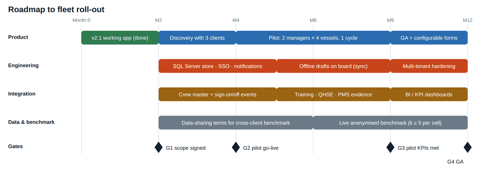

# 10 Decisions, Assumptions, Risks and Roadmap

*The product decisions behind the module and the reasons for them, the assumptions made without a written brief, the risk register, the 12-month roadmap and how success would be measured.*

| | |
| --- | --- |
| Document ID | FAD-10 |
| Version | 2.1 · 3 October 2026 |
| Author | Yasin Jariwala |
| Audience | Product and leadership reviewers |

**Purpose.** Makes the product thinking explicit: what was chosen, what was traded off, what was assumed, what could go wrong, and what comes next.

← [09 Maritime ERP Integration and Fit](09_Maritime_ERP_Integration_and_Fit.md) · [Index](README.md) · [11 Demo Script and FAQ](11_Demo_Script_and_FAQ.md) →

<strong>Contents</strong>

- [1. How the product evolved](#1-how-the-product-evolved)
- [2. Key product decisions](#2-key-product-decisions)
- [3. Assumptions](#3-assumptions)
- [4. Risk register](#4-risk-register)
- [5. Roadmap](#5-roadmap)
   - [5.1 Backlog beyond GA](#51-backlog-beyond-ga)
- [6. Measuring success](#6-measuring-success)
- [7. Open questions](#7-open-questions)

---

## 1. How the product evolved

The module went through three iterations in a short cycle, each driven by feedback:

**Table 1: Iterations**

| Version | Feedback that triggered it | What changed |
| --- | --- | --- |
| v1.0 / v1.1 | Brief: an HR appraisal module for maritime employees; two levels; no competency scoring | Office-set goals; per-tour reviews averaged by days on board |
| v2.0 | Feedback: the model was too static to try out; it needed interactive goals, self- and manager evaluation, maritime-standard levels, global comparison, login and role pages | Seafarer-set goals agreed by HOD; self-evaluation; 1–5 scale; four approval levels; fleet + industry comparison; .NET, database, tests |
| v2.0 review | Review question: are the Compare page calculations right? | Found and fixed the self-in-own-group bug; cross-checked 216 cases |
| v2.1 | Request: a deployable application with full page navigation | IIS + SQLite, passwords, a link for every screen, browser tests, this pack |

## 2. Key product decisions

**Table 2: Decision log**

| # | Decision | Options considered | Why this one | Trade-off accepted |
| --- | --- | --- | --- | --- |
| D-01 | One appraisal per calendar year | Per contract/tour; per year | With 4-on/4-off rotation, per-tour forms are fragmented and done by different appraisers; one yearly record gives one decision point before crew planning | Must handle sign-off before year end (evaluate in last 14 days on board) |
| D-02 | Weighted goals instead of competencies | Competency grid; goals; mix | Goals measure delivery on this vessel this year; competence is already evidenced by certificates and training records | Less comparable across ranks; mitigated by templates and goal areas |
| D-03 | Two levels (Officer, Non-Officer) | One level; per-rank forms; departments | Simple to run, matches how forms differ in practice; templates per level | Cadet and catering nuances handled by the library |
| D-04 | Self-evaluation before appraiser | Appraiser only; simultaneous; after | Seafarer's view on record; reduces surprises; the self–appraiser gap is a useful signal | Some inflation; shown, not hidden |
| D-05 | 1–5 scale with evidence for 1, 2 and 5 | 4-point; 0–120% achievement; 1–10 | Standard on ship-manager forms; a midpoint for "met"; evidence rule fights central tendency | Coarser than % |
| D-06 | Four approval levels with send-backs | Two levels; Master only | Matches industry practice (seafarer, HOD, Master/supt, office); send-backs fix errors without re-starting | More steps; mitigated by worklists and 7-day due dates |
| D-07 | Comparison with own score excluded and small-group flag | Simple rank; include self | Statistically honest "higher than x% of others"; avoids over-reading tiny groups | Harder to explain; documented with a worked example |
| D-08 | Seafarers see only themselves, anonymised peers | Full transparency; no comparison | Motivating without exposing colleagues; privacy by design | Less detail for seafarers |
| D-09 | Ratings never drive pay automatically | Formula-based increments | Keeps appraisal about development and fairness; avoids gaming; pay follows contract/CBA | No direct financial incentive |
| D-10 | One small web app for phone, tablet and PC | Native apps; desktop only | Low bandwidth, no install on ship PCs, works for seafarers at home | No offline mode yet |
| D-11 | SQLite for the pilot, SQL Server for scale | SQL Server only; cloud DB | Zero-install pilot; same model; scripts ready | Single-server limit for v2.1 |

## 3. Assumptions

No written brief was supplied. These assumptions were made and should be validated in discovery:

**Table 3: Assumptions**

| # | Assumption | If wrong |
| --- | --- | --- |
| A-01 | Rotation is about 4 months on board, 4 months at home | Timetable and "last 14 days on board" rule need tuning; contract-based period can be configured |
| A-02 | Clients want one yearly appraisal rather than per contract | Add a contract-based period option (per-tenant) |
| A-03 | Approval chain: HOD → Master/supt → Crewing Manager as tabulated | Chain is reference data; reconfigure without code |
| A-04 | The office decision maker is the Crewing Manager for every rank | Add per-rank office approver (e.g. Fleet Manager for senior officers) |
| A-05 | English is the working language for the form | Add UI translations; free text stays in the writer's language |
| A-06 | Seafarers have access to a phone or ship PC with intermittent internet | Offline drafts become a must for pilot |
| A-07 | Ratings from other managers can be obtained on the same 1–5 scale | Use scale mapping with clear labels, or a cross-client ERP pool |
| A-08 | Appraisal records are internal HR records, not part of the MLC record of employment | Legal review per flag; already designed to keep them separate |
| A-09 | Shore users are few named roles; vessels have one holder per rank | Support multiple holders (e.g. two 3/Os) — supported by Crew ID, chain still by rank |

## 4. Risk register

**Table 4: Risks (L = likelihood, I = impact)**

| # | Risk | L | I | Mitigation | Owner |
| --- | --- | --- | --- | --- | --- |
| R-01 | Everyone rated 4 to avoid conflict (central tendency) | H | H | Evidence for 1, 2, 5; fleet-vs-industry view; countersign can return; calibration sessions with superintendents | Crewing |
| R-02 | Self-ratings inflated | H | M | Gap shown on every appraisal and dashboard; guidance in 01 section 9 | Product |
| R-03 | Low adoption on board (time, connectivity) | M | H | Phone-first, under 15 minutes, pre-filled templates, worklists; offline drafts in v2.3 | Product |
| R-04 | Benchmark data not comparable or not available | H | M | Label source and date; same-scale rule; normalised percentiles; cross-client pool | Product |
| R-05 | Small groups give misleading percentiles | M | M | Flag under 4 others; k-anonymity thresholds for benchmark | Engineering |
| R-06 | Privacy breach (ratings or names exposed) | L | H | Server-side visibility rules; no names in benchmark; access by scope; security review | Engineering |
| R-07 | Appraisal used to justify unfair dismissal | L | H | Seafarer comment and disagreement on record; countersign; evidence rules; HR policy | HR |
| R-08 | Integration delays with Crew master data | M | M | Start with batch import; events later | Engineering |
| R-09 | Clients want their own form | H | M | Per-tenant configuration of areas, templates, thresholds, custom fields | Product |
| R-10 | Performance at multi-tenant scale | L | M | SQL Server store, stateless API, cached comparison results | Engineering |

## 5. Roadmap

<em>Figure 1: 12-month roadmap with gates</em>

**Table 5: Phases**

| Phase | Timing | Scope | Exit gate |
| --- | --- | --- | --- |
| Now: v2.1 | Done | Deployable module, tests, documentation | — |
| Discovery | Months 0–2 | Discovery sessions with 3 client crewing teams (tanker under TMSA, container, bulk); validate templates, scale, chain; prioritise backlog | G1: scope and pilot clients signed |
| Build for pilot: v2.2 | Months 2–4 | SQL Server store, SSO, notifications N-01–N-12 with reminders and escalation, Crew master + sign-on/off events, admin for templates and thresholds | G2: pilot go-live |
| Pilot: v2.3 | Months 4–9 | 2 client managers × 4 vessels on a shortened 6-month appraisal period; evidence panels (QHSE, PMS, training); offline drafts on board | G3: pilot KPIs met (section 6) |
| GA: v3.0 | Months 9–12 | Configurable forms per tenant, BI dashboards, multi-tenant hardening, live cross-client benchmark for opted-in clients | G4: general availability |

### 5.1 Backlog beyond GA

- Mid-year check-in (optional) for long contracts.
- Mid-year goal change with re-agreement.
- Cadet template built on training record book tasks.
- Promotion board view: candidates by rank with comparison and history.
- Retention analytics: re-hire rate of top-quartile performers.
- Assisted writing: suggested evidence text from QHSE/PMS records, always editable by the appraiser.

## 6. Measuring success

**Table 6: Success metrics**

| Level | Metric | Target |
| --- | --- | --- |
| Adoption | Appraisals opened that reach Done within the cycle | 90% |
| Adoption | Goals agreed by 31 January / 14 days after joining | 95% |
| Quality | Seafarer disagreement rate | under 10% |
| Quality | Evaluations with evidence for every 1, 2, 5 | 100% (enforced) |
| Quality | Spread of median rating between vessels, same rank | under 0.5 |
| Decision use | Office decisions with comparison opened | 80% |
| Effort | Median time per evaluation | under 15 minutes |
| Business | Re-hire rate of top-quartile seafarers (retention) | up 5 points year on year |
| Business | TMSA Element 3 appraisal findings at audit | zero |
| Product (ERP) | Clients adopting the module within 12 months of GA; clients opting into benchmark | set in discovery |

## 7. Open questions

- Which benchmark source for the pilot: agency pool, bilateral data-sharing, or an ERP cross-client pool?
- Should cadets have their own template built on training record book tasks?
- Should two consecutive years below 2.50 trigger an automatic not-for-re-hire review?
- Should senior officers (Master, C/E) be approved by a Fleet Manager rather than the Crewing Manager?
- Calendar-year or contract-based period as the default for clients?

---

← [09 Maritime ERP Integration and Fit](09_Maritime_ERP_Integration_and_Fit.md) · [Index](README.md) · [11 Demo Script and FAQ](11_Demo_Script_and_FAQ.md) →
